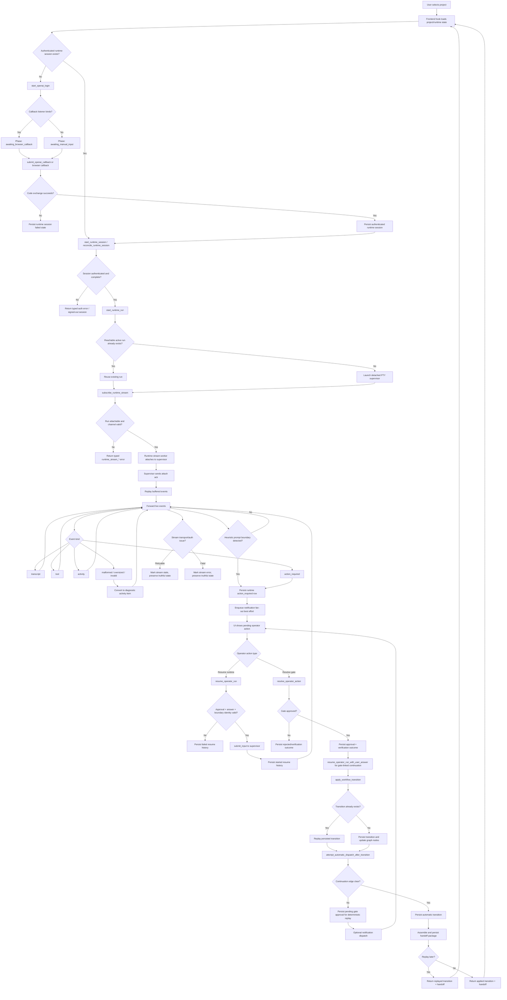

# Agentic Flow Walkthrough (`@client`)

This document describes the **actual agentic/runtime flow implemented in `@client`**, based on the desktop Tauri code, frontend adapter/hook logic, runtime supervisor, workflow persistence layer, and notification broker.

## Scope and truthfulness note

The most important finding first:

- `@client` **does not define or assemble a multi-step LLM system-prompt pipeline** of its own.
- It is a **desktop orchestration and supervision layer** around an external runtime/agent session.
- The code in `@client` handles:
  - auth/session state
  - supervised runtime launch
  - live-stream attach/replay
  - action-required/operator pause handling
  - workflow graph persistence and automatic transitions
  - notification dispatch/reply handling
  - idempotent recovery after crashes, disconnects, and malformed runtime output
- The **actual model/system prompt used by the external agent** is **not present in `@client`**.

So when you asked for “the system prompts used for each step”, the accurate answer for `@client` is:

- **LLM system prompts:** not defined here
- **System-authored operator/runtime prompt text:** yes, there are several, and they are listed below

---

## 1. What the app actually is

At a high level, Cadence desktop is a **control plane** for an agent/runtime, not the agent brain itself.

Core layers:

1. **Frontend adapter**
   - `client/src/lib/cadence-desktop.ts`
   - Typed Tauri command/event bridge.

2. **Frontend orchestration state**
   - `client/src/features/cadence/use-cadence-desktop-state.ts`
   - Owns project selection, auth state, runtime run state, live-stream subscription, operator actions, notification route refresh, and recovery logic.

3. **Tauri command surface**
   - `client/src-tauri/src/lib.rs`
   - Registers commands like:
     - `start_openai_login`
     - `start_runtime_session`
     - `start_runtime_run`
     - `subscribe_runtime_stream`
     - `resolve_operator_action`
     - `resume_operator_run`
     - `upsert_workflow_graph`
     - `apply_workflow_transition`
     - `sync_notification_adapters`

4. **Auth/session layer**
   - `client/src-tauri/src/auth/openai_codex.rs`
   - Handles OAuth flow, PKCE, refresh, manual callback fallback.

5. **Detached runtime supervisor**
   - `client/src-tauri/src/runtime/supervisor.rs`
   - Launches and supervises a detached PTY-backed runtime process.
   - Exposes a TCP control protocol for probe/attach/stop/submit-input.

6. **Runtime stream bridge**
   - `client/src-tauri/src/runtime/stream.rs`
   - Attaches to supervisor, replays buffered events, then streams live items to the UI.

7. **Durable state / workflow graph / operator loop**
   - `client/src-tauri/src/db/project_store.rs`
   - Stores runtime runs, approvals, resume history, workflow graph, transition events, and handoff packages.

8. **Notification broker**
   - `client/src-tauri/src/notifications/service.rs`
   - Sends operator prompts to Telegram/Discord and ingests replies.

---

## 2. High-level progression

The runtime flow is:

1. Project is selected/imported.
2. User starts OpenAI login.
3. App obtains or refreshes an authenticated runtime session.
4. App starts or reconnects to a detached supervised runtime run.
5. UI subscribes to runtime stream.
6. Supervisor replays buffered events, then forwards live events.
7. Runtime output is normalized into:
   - transcript
   - tool
   - activity
   - action_required
8. If runtime blocks on input, Cadence persists an operator approval row.
9. Operator can:
   - approve/reject a gate action, or
   - approve + resume a runtime boundary with a required answer
10. Workflow transitions can auto-dispatch to the next node.
11. If a gate is unresolved, Cadence pauses, persists a pending approval, and can fan out notifications.
12. Replies from Telegram/Discord are claimed and routed back into the same durable approval/resume flow.
13. Replay/restart/disconnect recovery preserves durable truth and rehydrates the UI from persisted state.

---

## 3. Step-by-step walkthrough

## Step 0 — Project and command surface bootstrap

The desktop host wires up all runtime/workflow commands in:

- `client/src-tauri/src/lib.rs`

Important consequence:

- the frontend does not call random Rust internals directly
- it only talks through explicit command contracts and typed event payloads
- that makes recovery and idempotency easier because every state mutation has a command seam

---

## Step 1 — Start OpenAI login

Entry point:

- `client/src-tauri/src/commands/start_openai_login.rs`
- backed by `client/src-tauri/src/auth/openai_codex.rs`

What happens:

1. Validate `projectId`.
2. Resolve project root.
3. Create an OAuth PKCE flow.
4. Try to bind a localhost callback listener.
5. If listener bind works:
   - phase becomes `awaiting_browser_callback`
6. If listener bind fails:
   - phase becomes `awaiting_manual_input`
   - login can still complete by pasting the redirect URL/code manually
7. Persist runtime session state and emit `runtime:updated`.

Auth phases defined in `client/src-tauri/src/commands/mod.rs`:

- `idle`
- `starting`
- `awaiting_browser_callback`
- `awaiting_manual_input`
- `exchanging_code`
- `authenticated`
- `refreshing`
- `cancelled`
- `failed`

### Recovery behavior here

Cadence is conservative and explicit:

- If callback listener bind fails, it does **not** abort the whole auth flow.
- It falls back to manual input mode.
- If the in-memory flow disappears later, `get_runtime_session` reconciles that to a persisted failure:
  - code: `auth_flow_unavailable`
  - message: `Cadence no longer has the in-memory OpenAI login flow for this project. Start login again.`

This is handled in:

- `client/src-tauri/src/commands/get_runtime_session.rs`

That is important: **it fails closed** rather than pretending the transient auth flow still exists.

---

## Step 2 — Reconcile or refresh runtime session

Entry point:

- `client/src-tauri/src/commands/start_runtime_session.rs`
- reconciliation in `client/src-tauri/src/commands/get_runtime_session.rs`

What happens:

1. Load current runtime session state for the project.
2. Reconcile against app-local auth store.
3. If already authenticated, keep it.
4. If stored auth exists but is expired, move to `refreshing` and refresh tokens.
5. Persist updated runtime session state and emit `runtime:updated`.

### Recovery behavior here

If the durable runtime session no longer matches the app-local auth store, Cadence signs the project back out instead of running with stale auth.

Examples:

- missing account id → `runtime_account_missing`
- no auth-store row → `auth_session_not_found`
- expired auth session → `auth_session_expired`

This is root-cause-first behavior: Cadence will not leave the project marked authenticated if its backing auth material is gone or expired.

---

## Step 3 — Start or reconnect a supervised runtime run

Entry point:

- `client/src-tauri/src/commands/start_runtime_run.rs`

What happens:

1. Load current durable runtime run snapshot.
2. If a run is already:
   - `starting` or `running`, and
   - transport liveness is `reachable`
   then Cadence returns that existing run instead of launching a duplicate.
3. If no reconnectable run exists, ensure runtime auth is ready.
4. Resolve shell selection using:
   - Unix default: `/bin/sh -i`
   - Windows default: `cmd.exe /Q`
   via `client/src-tauri/src/runtime/platform_adapter.rs`
5. Launch detached supervisor sidecar via:
   - `launch_detached_runtime_supervisor(...)`

### Important architectural point

Cadence is launching a **supervised shell/runtime process**, not composing a prompt here.

There is no “Step 3 system prompt” in the client code.

### Recovery behavior here

- Existing reachable run is reused.
- Duplicate launches are avoided.
- Missing auth yields explicit failures:
  - `runtime_run_auth_required`
  - `runtime_run_auth_in_progress`
  - `runtime_run_session_missing`

This is a clean boundary between auth truth and runtime launch truth.

---

## Step 4 — Supervisor sidecar boot and attachability

Runtime sidecar entry:

- `client/src-tauri/src/bin/cadence-runtime-supervisor.rs`

Protocol definitions:

- `client/src-tauri/src/runtime/protocol.rs`

Supervisor responsibilities:

- own the detached PTY
- expose a TCP control endpoint
- buffer live events in a ring buffer
- support:
  - `probe`
  - `stop`
  - `attach`
  - `submit_input`

Live event payload kinds:

- `transcript`
- `tool`
- `activity`
- `action_required`

### Recovery behavior here

The supervisor is designed so the UI can reconnect after interruption:

- attach returns an ack with:
  - `replayed_count`
  - `replay_truncated`
  - `oldest_available_sequence`
  - `latest_sequence`
- then buffered events are replayed before live streaming resumes

This means Cadence treats the supervisor as a replayable event source, not just a raw terminal socket.

---

## Step 5 — Subscribe to runtime stream

Command:

- `client/src-tauri/src/commands/subscribe_runtime_stream.rs`

Backend bridge:

- `client/src-tauri/src/runtime/stream.rs`

Frontend subscription:

- `client/src/lib/cadence-desktop.ts`
- `client/src/features/cadence/use-cadence-desktop-state.ts`

What happens:

1. UI asks to subscribe for selected item kinds.
2. Command validates:
   - authenticated runtime session exists
   - session has `session_id`
   - runtime run exists
   - runtime run is attachable (reachable + active)
   - JS channel exists
3. Rust starts a stream worker thread.
4. Stream worker:
   - validates stream identity
   - loads current runtime snapshot
   - attaches to supervisor
   - reads replay frames
   - forwards live frames
   - emits a terminal completion/failure item when appropriate

### Recovery behavior here

There are two separate layers of recovery:

#### Command precondition recovery

If auth/run is not ready, Cadence returns typed errors like:

- `runtime_stream_auth_required`
- `runtime_stream_not_ready`
- `runtime_stream_run_unavailable`
- `runtime_stream_run_stale`
- `runtime_stream_channel_missing`

#### Stream transport recovery

During attach/read Cadence explicitly handles:

- connect failure
- timeout
- socket close
- protocol mismatch
- run replacement
- session mismatch
- flow mismatch

Examples:

- `runtime_stream_attach_connect_failed`
- `runtime_stream_attach_timeout`
- `runtime_stream_attach_closed`
- `runtime_stream_contract_invalid`
- `runtime_stream_run_replaced`
- `runtime_stream_session_stale`

The stream controller also guarantees **only one active stream generation at a time**; starting a new stream cancels the old lease.

---

## Step 6 — Normalize live runtime output

Normalization happens in:

- `client/src-tauri/src/runtime/supervisor.rs`

Cadence does not trust raw PTY output blindly.

It normalizes output into structured event types.

### Supported structured prefix

If the external runtime emits lines prefixed with:

- `__CADENCE_EVENT__ `

Cadence tries to parse JSON and accepts only known kinds.

### If the runtime does not emit structured events

Cadence still treats PTY lines as transcript output and applies heuristics.

### LLM mistake / malformed output recovery

This is where a lot of robustness lives.

Cadence handles malformed runtime output by:

- dropping blank payloads
- dropping oversized fragments
- rejecting malformed JSON
- rejecting unsupported event kinds
- converting failures into diagnostic `activity` events instead of poisoning state

Examples of emitted diagnostic codes:

- `runtime_supervisor_live_event_blank`
- `runtime_supervisor_live_event_oversized`
- `runtime_supervisor_live_event_invalid`
- `runtime_supervisor_live_event_unsupported`
- `runtime_supervisor_live_event_decode_failed`

This is the main answer to “how it recovers from LLM mistakes”:

> Bad or malformed model/runtime output is treated as **diagnostic activity**, not as authoritative state.

That prevents a hallucinated or malformed event payload from corrupting durable workflow state.

---

## Step 7 — Detect interactive boundaries (`action_required`)

Cadence can get action-required events in two ways:

1. External runtime emits a structured `action_required` event.
2. Cadence infers an interactive boundary from PTY prompt-like output.

Heuristic function:

- `looks_like_interactive_boundary(...)` in `client/src-tauri/src/runtime/supervisor.rs`

Typical heuristics:

- line ends with `:`, `?`, `>`, `]`, or `)`
- contains input/prompt words like:
  - `enter`
  - `input`
  - `provide`
  - `type`
  - `password`
  - `token`
  - `code`
  - `approve`
  - `answer`
  - `choose`
- not an obvious log prefix like `error:` or `warning:`

If a boundary is detected, Cadence persists it durably with:

- run id
- session id
- flow id
- boundary id
- action type
- title
- detail

Persistence path:

- `project_store::upsert_runtime_action_required(...)`

This is where transient terminal blocking becomes a durable operator task.

---

## Step 8 — Persist operator approval and optionally fan out notifications

When an interactive boundary or unmet workflow gate is persisted, Cadence can enqueue notification dispatches.

Notification sync command:

- `client/src-tauri/src/commands/sync_notification_adapters.rs`

Broker implementation:

- `client/src-tauri/src/notifications/service.rs`

### Why this matters architecturally

Notification fan-out is **post-commit enrichment**.

The primary truth is the durable approval row.
Notification dispatch is secondary.

That means:

- operator checkpoint durability does not depend on Telegram/Discord being healthy
- notification failures do not roll back the operator pause itself

This is a good failure boundary.

---

## Step 9 — Resolve vs resume operator actions

There are two related but distinct actions.

### 9A. Resolve operator action

Command:

- `client/src-tauri/src/commands/resolve_operator_action.rs`

Used when the operator is deciding a durable approval row.

- `approve`
- `reject`

For gate-linked and runtime-resumable approvals, a non-empty `userAnswer` is required.
The frontend enforces this through schema/policy in:

- `client/src/lib/cadence-model.ts`

### 9B. Resume operator run

Command:

- `client/src-tauri/src/commands/resume_operator_run.rs`

Used when the approved action should resume a live runtime boundary.

Flow:

1. Prepare a durable resume target from approval row.
2. Verify approval status is `approved`.
3. Verify durable `userAnswer` exists and matches expected answer if supplied.
4. Verify session/run/boundary/action identity matches current live boundary.
5. Call supervisor `submit_input`.
6. Persist resume-history outcome as `started` or `failed`.

### Recovery behavior here

Cadence fails closed on identity mismatch.

Examples:

- malformed runtime action identity → `operator_action_runtime_identity_invalid`
- approved answer mismatch → `operator_resume_answer_conflict`
- missing durable answer → `operator_resume_answer_missing`
- missing session id → `operator_resume_session_missing`
- stale boundary mismatch at supervisor edge:
  - `runtime_supervisor_action_unavailable`
  - `runtime_supervisor_action_mismatch`
  - `runtime_supervisor_session_mismatch`

This is strong protection against resuming the wrong prompt/run/boundary.

---

## Step 10 — Workflow graph and automatic progression

Commands:

- `upsert_workflow_graph`
- `apply_workflow_transition`

Persistence logic:

- `client/src-tauri/src/db/project_store.rs`

Cadence models a planning lifecycle as a workflow graph.

Canonical lifecycle stages include:

- `discussion`
- `research`
- `requirements`
- `roadmap`

Defined in:

- `client/src-tauri/src/commands/mod.rs`
- `client/src/lib/cadence-model.ts`

### What happens on transition

When `apply_workflow_transition(...)` is called:

1. Validate edge exists.
2. Apply gate updates.
3. Reject transition if unresolved required gates remain.
4. Mark source node complete.
5. Mark target node active.
6. Insert transition event.
7. Attempt automatic dispatch to the next node.

### Idempotency behavior

This is one of the strongest parts of the system.

Transitions are idempotent by `transition_id`:

- if the same transition already exists, Cadence returns a **replayed** outcome instead of duplicating rows

That same pattern applies to:

- automatic dispatch transitions
- workflow handoff package persistence

The tests in `client/src-tauri/tests/runtime_run_bridge.rs` are explicit about this behavior.

---

## Step 11 — Gate pause branch vs completion branch

Automatic dispatch can go two ways.

### Completion branch

If continuation edges are clear:

- Cadence applies the next transition automatically
- persists a handoff package
- can replay that same automatic dispatch deterministically later

### Gate pause branch

If continuation is blocked by unresolved gates:

- Cadence does **not** force the transition
- it persists a pending operator approval
- it returns an automatic-dispatch outcome with status `skipped`
- the message explicitly says the pause was persisted for deterministic replay

That message comes from `attempt_automatic_dispatch_after_transition(...)` in `project_store.rs`.

This is how Cadence avoids losing place when a human decision is required.

---

## Step 12 — Handoff package persistence

After a successful automatic transition, Cadence assembles a workflow handoff package.

Purpose:

- preserve transition linkage
- capture destination state
- preserve operator continuity metadata
- support restart/replay without reconstructing the world from scratch

Durable protections include:

- canonicalized serialized payload
- package hash
- replay-safe insert semantics
- linkage validation against the transition event
- redaction checks to prevent secret-bearing payloads from being persisted

Examples of fail-closed behavior:

- hash mismatch → reject overwrite
- redaction failure → refuse package assembly
- missing transition linkage → fail

This is not cosmetic. It is the durable context handoff that makes replay safe.

---

## Step 13 — Notification broker round-trip

Notification broker formats a real operator prompt and sends it to Telegram/Discord.

Dispatch template from `client/src-tauri/src/notifications/service.rs`:

```text
Cadence requires operator input.

Route: <kind>:<channel-target>
Action ID: <action_id>
Action Type: <action_type>
Title: <title>
Detail: <detail>

Correlation key: <correlation_key>
Reply with one line:
approve <correlation_key> <answer>
reject <correlation_key> <answer>
```

### Reply recovery behavior

Inbound replies are parsed strictly in:

- `client/src-tauri/src/notifications/telegram.rs`
- `client/src-tauri/src/notifications/discord.rs`

Expected grammar:

```text
<decision> <correlation-key> <answer>
```

Examples of fail-closed rejection:

- empty body
- unsupported decision
- malformed correlation key
- empty required-input answer
- duplicate claim after another channel already won

The broker uses **first-wins** claim semantics for replies.
That prevents the same action being resumed twice from two channels.

---

## 4. “System prompts used for each step” — accurate inventory

Because `@client` does not build the LLM prompt stack, the right way to answer this is to separate:

1. **LLM system prompts** — not present here
2. **System-authored runtime/operator prompt text** — present here

## 4.1 LLM system prompts

### Result: not present in `@client`

I did not find client-side code that constructs or stores an LLM system prompt, developer prompt, or per-step chat prompt.

What `@client` does instead:

- launches a supervised shell/runtime
- listens for structured runtime events
- persists workflow/operator state around that runtime

So for these steps:

| Step | LLM system prompt in `@client`? | Notes |
|---|---:|---|
| OpenAI login | No | OAuth only |
| Runtime session bind/refresh | No | Session state only |
| Runtime run start | No | Launches detached shell/runtime |
| Live streaming | No | Reads event protocol |
| Workflow transition | No | Persistence and graph logic |
| Operator resume | No | Sends approved input to PTY |
| Notification sync | No | Formats operator notifications |

If the external runtime uses a model/system prompt, it is outside the visible `@client` codebase.

## 4.2 Actual system-authored prompt-like text found in `@client`

### A. Interactive boundary fallback text

Defined in `client/src-tauri/src/runtime/supervisor.rs`:

```text
Action type: terminal_input_required
Title: Terminal input required
Detail: Detached runtime is blocked on terminal input. Approve and resume with a coarse operator answer to continue the same supervised run.
Checkpoint summary: Detached runtime blocked on terminal input and is awaiting operator approval.
```

This is the default prompt Cadence creates when it detects a terminal input boundary heuristically.

### B. Notification dispatch prompt template

Defined in `client/src-tauri/src/notifications/service.rs`:

```text
Cadence requires operator input.

Route: <kind>:<channel-target>
Action ID: <action_id>
Action Type: <action_type>
Title: <title>
Detail: <detail>

Correlation key: <correlation_key>
Reply with one line:
approve <correlation_key> <answer>
reject <correlation_key> <answer>
```

This is a real prompt authored by the system.

### C. OAuth success page copy

Defined in `client/src-tauri/src/auth/openai_codex.rs`:

```text
Authentication successful. Return to Cadence to continue.
```

Not an LLM prompt, but part of the user-facing flow.

### D. Gate prompt metadata

Gate prompts are not hardcoded globally. They are stored as workflow-gate metadata via `upsert_workflow_graph`:

- `action_type`
- `title`
- `detail`

Examples in tests:

```text
Approve execution
Operator approval required.
```

and

```text
Approve roadmap
Review roadmap draft before scheduling.
```

Those are durable operator-facing prompts, but they are data-driven rather than fixed program constants.

---

## 5. How Cadence recovers from errors and LLM/runtime mistakes

## 5.1 Auth recovery

Cadence handles auth degradation explicitly.

Recovery patterns:

- callback listener bind fails → manual callback mode
- in-memory flow missing → `auth_flow_unavailable`
- auth-store row missing/expired → sign project back out
- refresh failure → phase becomes `failed`

Result:

- no silent auth drift
- no fake authenticated state

## 5.2 Runtime launch recovery

Recovery patterns:

- reuse existing reachable run instead of duplicating
- block launch while auth is incomplete
- typed failures for missing session/supervisor binary

Result:

- fewer ghost runs
- fewer split-brain runtime states

## 5.3 Live stream recovery

Recovery patterns:

- attach retries
- buffered replay before live stream resumes
- same-run dedupe by monotonic sequence
- same-action dedupe for `action_required`
- stale run/session mismatch causes abandonment of old stream
- retryable issues degrade stream to `stale`
- non-retryable issues degrade stream to `error`

Frontend model behavior in `client/src/lib/cadence-model.ts`:

- retryable failure → `stale`
- non-retryable failure → `error`
- same sequence replay → ignored
- lower sequence → rejected as non-monotonic
- different run → ignored/preserved until new run state takes over

## 5.4 Malformed LLM/runtime output recovery

This is the main “LLM mistake” defense.

Cadence assumes the runtime may emit:

- malformed JSON
- oversized output
- unsupported event kinds
- blank/garbage structured payloads
- secret-bearing output

Instead of trusting that output, Cadence:

- normalizes it
- redacts sensitive content
- turns malformed frames into diagnostic activity items
- preserves prior truthful state

This is fail-soft for observation, fail-closed for mutation.

## 5.5 Operator loop recovery

Cadence refuses to resume unless:

- approval is approved
- answer exists when required
- answer matches durable stored answer
- session/run/boundary/action identity still matches

It also records resume history with explicit `started` or `failed` outcomes.

Result:

- replayable operator decisions
- no ambiguous half-resume state

## 5.6 Workflow recovery

Cadence uses deterministic IDs and replay-aware logic:

- transition IDs make workflow events idempotent
- automatic dispatch replays instead of duplicating
- handoff packages are hashed and replay-safe
- unresolved gates produce durable pending approvals instead of dropping continuation

Result:

- crash/retry paths can be re-entered safely

## 5.7 Notification recovery

Notification handling is designed as enrichment, not primary truth.

Recovery patterns:

- dispatch outcome persisted separately
- route/credential failures produce typed diagnostics
- first inbound reply claim wins
- duplicates are rejected, not merged
- malformed cursor state is reset conservatively

Result:

- operator checkpoint truth survives channel issues

---

## 6. Accurate Mermaid workflow chart



---

## 7. Practical conclusion

If you are auditing `@client` as an “agentic system”, the right mental model is:

- **not**: “Cadence is a multi-step prompt engine”
- **yes**: “Cadence is a durable supervisor + workflow/orchestration shell around an external agent/runtime”

Its strongest properties are:

- replayable detached runtime supervision
- durable operator checkpoints
- fail-closed approval/resume identity checks
- idempotent workflow transitions
- replay-safe handoff packaging
- notification broker as post-commit enrichment
- malformed runtime output downgraded to diagnostics instead of state corruption

Its main limit, relative to your question, is also clear:

- if you want the **actual LLM system prompts**, they are **not stored in `@client`**
- `@client` only supervises the runtime that would consume them

If you want, I can also produce a second document that maps this walkthrough to specific functions and error codes in a code-index format.