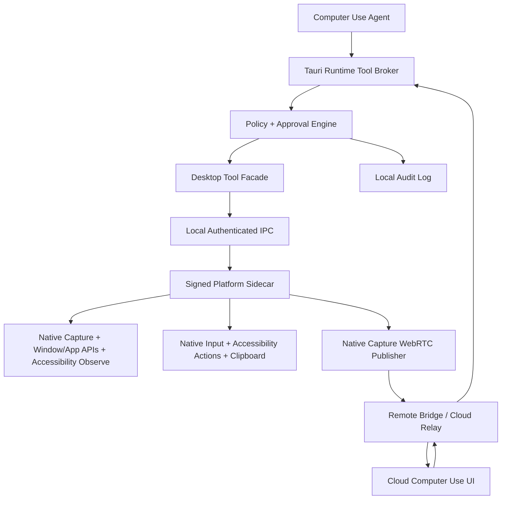

# Computer Use Full Desktop Control Plan

## Reader And Outcome

This plan is for engineers implementing production-grade full desktop control for Xero's Computer Use agent, plus desktop streaming and manual control from the cloud app. After reading it, an engineer should be able to start implementation, split the work into reviewable milestones, and understand the security boundaries that must hold before the feature ships.

## Executive Summary

The current Computer Use agent is intentionally constrained. It can use browser automation, emulator tools, macOS app/window observation and focus/launch helpers, screenshots with approval, system diagnostics observation, read-only project context, and its own planning/discovery tools. It cannot run shell commands, edit files, use MCP tools, use skills, spawn subagents, manage processes, or perform arbitrary native mouse and keyboard input.

The production target is a controlled desktop automation layer that gives the Computer Use agent real native desktop observation and input primitives without turning the agent into an unrestricted local executor. The safest design is a signed native sidecar/helper, reached through a narrow local IPC API, with explicit permission checks, per-run policy, operator approvals, audit logs, and an immediate kill switch. macOS, Windows, and Linux are all first-release platform targets. The shared sidecar contract must be defined up front, then all three platform sidecars should be implemented as concurrent workstreams. Cloud streaming should be added as a separate secure media/signaling layer using WebRTC, with cloud control commands still routed through the same local policy and approval system.

## Current State

Computer Use today is a bounded UI runtime:

- Allowed Computer Use tools are limited to tool discovery/access, todo, read-only project context, browser observe/control, emulator, macOS automation, and system diagnostics observation.
- The runtime blocks file writes, edits, shell/command execution, git, process manager access, MCP, skills, and subagents.
- macOS automation can check permissions, list apps/windows, launch apps, activate/focus windows, quit apps, and capture screenshots behind approval.
- There is no native desktop input tool for mouse movement, clicking, dragging, scrolling, typing, hotkeys, menu interaction, or Accessibility-driven element actions.
- The cloud app can start and message a Computer Use session and resolve approvals through the remote bridge, but it does not receive a live desktop stream and does not send raw remote mouse/keyboard commands.
- Browser control is limited to Xero's in-app browser surface, not arbitrary native apps.

## Goals

- Add real desktop observation on macOS, Windows, and Linux: displays, screenshots, windows, foreground app, cursor state, selected app metadata, Accessibility tree snapshots, and local OCR where platform support allows.
- Add real desktop control on macOS, Windows, and Linux: mouse, keyboard, scroll, drag, focus, app launch/quit, menu actions where feasible, Accessibility actions, text insertion, and clipboard-mediated paste when explicitly allowed.
- Add a secure cloud desktop stream for Computer Use sessions so a remote user can watch what the agent is doing.
- Support cloud-originated manual control in the first public release, but only through the same local controller, policy checks, approvals, and kill switch.
- Draft the shared sidecar contract in Phase 0, then build macOS, Windows, and Linux sidecars together starting in Phase 1. Do not treat Windows/Linux as follow-up ports.
- Preserve a strong distinction between desktop UI automation and engineering tools. Full desktop control must not imply shell access, repo file access, MCP access, or arbitrary script execution.
- Make every sensitive action observable, auditable, interruptible, and policy-gated.
- Ship with tests, telemetry, failure-mode handling, documentation, and rollout controls.

## Non-Goals

- Do not add a generic shell/script runner to Computer Use.
- Do not allow cloud clients to bypass local runtime authorization or approval gates.
- Do not persist raw desktop video or support session recording.
- Do not support unattended use on locked, logged-out, or sleeping desktops in the first production release.
- Do not add backward-compatible migration glue for legacy `.xero/` state as part of this work.
- Do not use this feature to automate password managers, Keychain secrets, payment confirmation, identity verification, or security recovery flows without explicit future policy work.

## Success Criteria

- A Computer Use run can observe and interact with normal macOS, Windows, and Linux apps using mouse, keyboard, scroll, drag, app focus, and app launch primitives where the platform permits.
- The shared sidecar contract is validated by active macOS, Windows, and Linux implementation work.
- The cloud app can show a low-latency live desktop stream for an active Computer Use session.
- Sensitive operations trigger approvals before execution.
- The user can pause or terminate control locally and from the cloud.
- The local user can physically take over the machine and the agent backs off.
- All desktop actions are recorded in an audit log with timestamps, session ID, actor, target app/window when known, action type, policy decision, and approval ID when applicable.
- The sidecar/helper cannot be used as a general-purpose command executor.
- Permission-denied, screen-recording-denied, accessibility-denied, helper-crashed, network-disconnected, and cloud-revoked-device cases fail safely.
- CI covers policy decisions, tool schemas, IPC validation, cloud signaling contracts, and fallback behavior.

## Product Scope

### Local Agent Control

The Computer Use agent gets a new desktop tool group that exposes high-level, validated desktop actions. The agent sees screenshots and structured state, chooses an action, and the local runtime decides whether the action is allowed, approval-gated, or denied.

### First-Release Platforms

macOS, Windows, and Linux are all in scope for the first production release. Platform work should proceed in parallel from the first sidecar milestone, with macOS-specific, Windows-specific, and Linux-specific APIs hidden behind the same platform-neutral tool and IPC contract.

### Cloud Viewing

The cloud app gets a live stream view attached to the global Computer Use session. The stream is watch-first: users can monitor agent behavior, see permission prompts, and stop the run.

### Cloud Manual Control

Manual cloud control is part of the first public release and should be treated as a separate mode. It must acquire the same exclusive controller lock as the agent, route all input through the desktop control broker, show a visible local indicator, and stop automatically on inactivity or local user takeover.

## Proposed Architecture



## Core Components

### Tauri Runtime Tool Broker

The Tauri app remains the authority for active session identity, Computer Use policy, approvals, audit logging, cloud authorization, and tool registration. It should expose new Computer Use-only tool groups rather than broadening existing engineering tools.

Responsibilities:

- Register desktop observe/control/stream tools only for the Computer Use runtime.
- Validate tool payloads before calling the sidecar.
- Enforce per-run policy and stage allowlists.
- Request operator approval for sensitive operations.
- Maintain one active desktop controller lock.
- Emit structured runtime events for cloud and local UI.
- Write audit events to OS app-data state.
- Start, stop, and health-check the sidecar.

### Platform Sidecars

Implement signed native helpers for desktop control behind one shared sidecar contract. macOS, Windows, and Linux should be developed concurrently. Prefer Swift for the macOS sidecar because ScreenCaptureKit, Vision OCR, Accessibility, AppKit, and VideoToolbox are first-class there. Prefer Rust for Windows and Linux sidecars unless platform API bindings or media stacks make a small native-language component clearly better. Keep the IPC surface stable through JSON Schema or protobuf so each platform can use the best local implementation language without changing agent tools.

Responsibilities:

- Screen capture using the platform-native capture stack.
- Display, window, app, and cursor metadata collection.
- Accessibility permission checks and AX tree snapshots.
- Local OCR for screen understanding, weak Accessibility support, and redaction.
- Mouse and keyboard injection using platform-native input APIs.
- Accessibility actions such as press, focus, set value, and menu selection where reliable.
- Clipboard-mediated paste only when explicitly requested and policy-allowed.
- WebRTC media publishing or raw-frame handoff to the Tauri process.
- Return precise permission and error states.
- Refuse any operation outside the declared IPC schema.

Sidecar constraints:

- No shell execution API.
- No arbitrary file read/write API.
- No plugin loading.
- No unauthenticated socket.
- No long-lived control without an active session lease.
- No background control after session end.

### Desktop Tool Facade

Add three primary tool families.

`desktop_observe`:

- `permissions_status`
- `display_list`
- `window_list`
- `app_list`
- `foreground_state`
- `screenshot`
- `cursor_state`
- `accessibility_snapshot`
- `ocr_snapshot`
- `element_at_point`
- `health`

`desktop_control`:

- `mouse_move`
- `mouse_click`
- `mouse_double_click`
- `mouse_right_click`
- `mouse_drag`
- `scroll`
- `key_press`
- `hotkey`
- `type_text`
- `paste_text`
- `focus_window`
- `activate_app`
- `launch_app`
- `quit_app`
- `ax_press`
- `ax_set_value`
- `ax_focus`
- `menu_select`
- `cancel_current_action`

`desktop_stream`:

- `stream_capabilities`
- `stream_start`
- `stream_stop`
- `stream_status`
- `stream_set_quality`
- `stream_request_keyframe`

### Cloud Streaming

Use WebRTC for production streaming. It gives encryption, congestion control, low latency, NAT traversal, and browser-native playback.

Recommended design:

- Desktop side captures frames with ScreenCaptureKit.
- Desktop publishes video through WebRTC.
- Existing remote bridge or Phoenix channels provide signaling messages: offer, answer, ICE candidates, stream start/stop, and stream health.
- Use short-lived stream tokens tied to computer ID, session ID, paired web device, and current run ID.
- Use TURN for networks where peer-to-peer connectivity fails.
- Send pointer overlays and agent action markers as data-channel events or normal relay events.
- Do not persist video frames or support stream recording.

Fallback design:

- If WebRTC fails, fall back to periodic JPEG/WebP screenshots via existing runtime media artifact fetches.
- Limit fallback frame rate, resolution, and retention.
- Show degraded-stream state clearly in cloud UI.

### Cloud UI

The cloud Computer Use session page should add a desktop viewport when streaming is available.

Required UI states:

- Waiting for desktop.
- Permission required on desktop.
- Connecting stream.
- Live stream.
- Stream degraded.
- Stream paused.
- Agent controlling.
- Manual control active.
- Local user took control.
- Session ended.
- Device revoked or offline.

Required controls:

- Start or request stream.
- Pause stream.
- Stop Computer Use run.
- Emergency stop control.
- Request manual control.
- Release manual control.
- Quality selector.
- Approval panel for sensitive actions.

Do not expose direct browser DOM controls as a substitute for desktop control. The viewport should represent the actual desktop or the documented degraded screenshot mode.

## Permissions Model

macOS, Windows, and Linux each require different user-granted permissions or desktop-session capabilities for this feature. Build a local permission wizard in the desktop app that presents platform-specific requirements through one shared permission model.

Required macOS permissions:

- Screen Recording for desktop screenshots and streaming.
- Accessibility for native UI actions and AX snapshots.
- Input Monitoring if required by the selected keyboard/mouse strategy.
- Automation permissions for app-level Apple Events if menu/app actions use them.

Required Windows capabilities:

- Screen capture consent through Windows Graphics Capture where prompted.
- UI Automation access for structured UI observation and element actions.
- Input injection through approved desktop APIs.
- Firewall/network permission where needed for local streaming components.

Required Linux capabilities:

- Wayland portal screen capture and remote-desktop consent where available.
- PipeWire access for Wayland capture streams.
- AT-SPI access for Accessibility observation and actions.
- X11 capture/input fallback where the active session is X11 and policy allows it.

Permission UX requirements:

- Explain each permission in plain language.
- Show current status and required restart/retry steps.
- Provide buttons that open the correct macOS Settings panes.
- Detect and refresh permission status without requiring app restart where possible.
- Keep the feature disabled until required permissions are granted.
- Never ask the cloud user to fix local macOS permissions without showing that the action must happen on the desktop.

## Policy And Safety

### Controller Lock

Only one actor may control the desktop at a time:

- Computer Use agent.
- Local user.
- Cloud manual-control user.

The controller lock should include actor, session ID, run ID, lease expiration, last input time, and release reason. Local physical input should either pause agent control or downgrade it to observe-only until the user resumes.

### Kill Switch

Implement stop controls in three places:

- Local desktop app persistent control bar.
- Cloud session page.
- Runtime command path for canceling a Computer Use run.

Emergency stop must:

- Release controller lock.
- Stop all pending sidecar actions.
- Stop streaming if requested by user policy.
- Cancel active agent run.
- Write an audit event.
- Leave the sidecar alive only in idle mode.

### Approval Gates

Require approval for:

- Launching newly untrusted apps.
- Quitting apps with unsaved changes when detectable.
- Sending messages, emails, posts, or form submissions outside a low-risk allowlist.
- Purchasing, ordering, transferring funds, or payment confirmation.
- Changing passwords, security settings, MFA, recovery codes, or account ownership.
- Installing, uninstalling, or updating apps.
- Deleting user data.
- Uploading or downloading files.
- Reading or copying clipboard content from the user environment.
- Pasting sensitive text supplied by the user.
- Interacting with password managers, Keychain, system privacy settings, browser saved passwords, or wallet apps.
- Enabling manual cloud control.

### Deny By Default Zones

Block or pause automation in high-risk contexts by default:

- Password manager apps and browser password managers.
- Keychain Access.
- System Settings privacy and security panes.
- Banking, brokerage, tax, payroll, crypto, insurance, and payment sites unless future product policy explicitly permits them.
- MFA/recovery-code screens.
- OS update, disk erase, device management, and remote-login settings.

Terminal, IDEs, browser developer tools, database consoles, and similar developer surfaces are allowed desktop targets like other apps. This only permits visible UI control. It does not grant Computer Use internal shell, git, MCP, process manager, file mutation, or script execution tools.

### Redaction

Implement redaction before state reaches model or cloud where feasible:

- Password fields.
- One-time codes.
- Recovery phrases.
- Credit card fields.
- API keys and secrets detected in UI text.
- Areas manually marked private by the local user.

Redaction should apply to screenshots, OCR output, AX text snapshots, stream overlays when possible, and audit log previews. Use a balanced policy: redact high-confidence sensitive content automatically, warn or request approval for medium-confidence sensitive content, and continue for low-confidence findings. User-marked private regions are always hard-redacted.

## Security Design

### Local IPC

Use a local-only Unix domain socket or named pipe with a per-session token minted by Tauri. The sidecar should accept requests only when:

- The caller proves possession of the token.
- The session lease is active.
- The request schema validates.
- The operation is in the allowed sidecar operation set.
- The Tauri runtime has approved or pre-authorized the operation.

Recommended message fields:

- `schemaVersion`
- `requestId`
- `sessionId`
- `runId`
- `actor`
- `operation`
- `payload`
- `policyDecisionId`
- `expiresAt`

### Cloud Authorization

Cloud stream and control must require:

- Existing paired web device authorization.
- Active desktop online state.
- Current session authorization.
- Short-lived stream token.
- Computer ID and session ID binding.
- Revocation checks.
- Rate limits.
- Audit events for join, leave, start stream, stop stream, manual control requested, manual control granted, and manual control released.

### Data Handling

- Do not store raw video or diagnostic video clips.
- Store only minimal stream metadata: start/end, participant, bitrate, resolution, errors.
- Store action audit records locally in OS app-data.
- Redact or hash sensitive target text.
- Keep any uploaded debug bundles opt-in and bounded.
- Separate stream transport tokens from normal API auth tokens.

## Tool Contracts

### Permission Status

```json
{
  "tool": "desktop_observe",
  "action": "permissions_status",
  "result": {
    "screenRecording": "granted",
    "accessibility": "granted",
    "inputMonitoring": "unknown",
    "automation": "limited",
    "canControl": true,
    "canStream": true
  }
}
```

### Screenshot

```json
{
  "tool": "desktop_observe",
  "action": "screenshot",
  "displayId": "main",
  "redaction": {
    "mode": "auto",
    "privateRegions": []
  }
}
```

Response:

```json
{
  "requestId": "req_123",
  "imageArtifactId": "media_456",
  "width": 3024,
  "height": 1964,
  "scaleFactor": 2,
  "capturedAt": "2026-05-26T12:00:00Z",
  "redactionsApplied": 3
}
```

### OCR Snapshot

```json
{
  "tool": "desktop_observe",
  "action": "ocr_snapshot",
  "displayId": "main",
  "region": {
    "x": 0,
    "y": 0,
    "width": 1512,
    "height": 982
  },
  "redaction": {
    "mode": "balanced"
  }
}
```

Response:

```json
{
  "requestId": "req_ocr_123",
  "capturedAt": "2026-05-26T12:00:00Z",
  "textBlocks": [
    {
      "text": "Continue",
      "x": 1140,
      "y": 812,
      "width": 120,
      "height": 36,
      "confidence": 0.98
    }
  ],
  "redactionsApplied": 1,
  "storage": "ephemeral"
}
```

### Mouse Click

```json
{
  "tool": "desktop_control",
  "action": "mouse_click",
  "displayId": "main",
  "x": 1200,
  "y": 840,
  "button": "left",
  "clicks": 1,
  "reason": "Select the visible Continue button"
}
```

Response:

```json
{
  "requestId": "req_124",
  "status": "executed",
  "policyDecision": "allowed",
  "foregroundAppBefore": "Safari",
  "foregroundAppAfter": "Safari"
}
```

### Text Input

```json
{
  "tool": "desktop_control",
  "action": "type_text",
  "text": "hello@example.com",
  "sensitivity": "normal",
  "targetHint": "Email field"
}
```

Response:

```json
{
  "requestId": "req_125",
  "status": "executed",
  "policyDecision": "allowed",
  "method": "keyboard_events"
}
```

### Stream Start

```json
{
  "tool": "desktop_stream",
  "action": "stream_start",
  "sessionId": "agent-session-global-computer-use",
  "runId": "run_789",
  "displayId": "main",
  "maxWidth": 1920,
  "maxFrameRate": 30,
  "includeCursor": true
}
```

Response:

```json
{
  "requestId": "req_126",
  "status": "starting",
  "transport": "webrtc",
  "streamId": "stream_abc",
  "signalingChannel": "computer_use_stream"
}
```

## Runtime Integration Plan

### 1. Add Desktop Capability Descriptors

Add new descriptors for desktop observation, control, and streaming. Keep them separate from the existing `macos_automation` descriptor so the older limited tool can remain stable while the new capability ships behind a feature flag.

Implementation notes:

- Add tool schemas in the same style as existing autonomous tool descriptors.
- Add capability metadata in runtime policy.
- Add Computer Use prompt guidance that explains desktop tools, safety gates, and limits.
- Ensure the tool access filter exposes these tools only to Computer Use.
- Keep engineering agents blocked unless explicitly given a future separate capability.

### 2. Add Policy Enforcement

Create a desktop action classifier that maps every desktop request to a policy category:

- Observe safe.
- Observe sensitive.
- Control safe.
- Control approval required.
- Control denied.
- Stream safe.
- Stream approval required.
- Stream denied.

The policy layer should receive current app/window context when available. For example, `type_text` into Notes may be allowed, while `type_text` into a password manager should be denied or require user intervention.

### 3. Add Sidecar Process Manager

The Tauri app should own sidecar lifecycle:

- Locate bundled sidecar.
- Verify signature or checksum.
- Spawn sidecar when desktop tools are first requested.
- Provide session token over stdin or inherited secure channel.
- Health-check sidecar.
- Restart only when safe.
- Terminate on app shutdown.
- Surface sidecar errors to the run timeline.

Do not reuse the general process manager tool for this. The sidecar manager is internal infrastructure, not an agent-accessible process tool.

### 4. Add IPC Client

Build a typed Rust client for the sidecar IPC:

- Request/response structs.
- Timeout handling.
- Cancellation handling.
- Schema version negotiation.
- Error mapping to tool output.
- Event subscription for stream state and permission changes.

All IPC calls should be cancellable when the run is canceled or emergency stop is triggered.

### 5. Add Tool Implementations

Implement tool handlers in the autonomous runtime:

- Parse tool input.
- Validate coordinates and display IDs.
- Attach session/run/actor metadata.
- Fetch current policy context.
- Run policy decision.
- Request approval if needed.
- Call sidecar.
- Emit audit and timeline events.
- Return compact structured result to the model.

### 6. Update Remote Bridge

Extend remote bridge command contracts for streaming:

- `computer_use_stream_request`
- `computer_use_stream_offer`
- `computer_use_stream_answer`
- `computer_use_stream_ice_candidate`
- `computer_use_stream_stop`
- `computer_use_stream_status`

Keep manual control separate:

- `computer_use_manual_control_request`
- `computer_use_manual_control_grant`
- `computer_use_manual_control_input`
- `computer_use_manual_control_release`

Manual input commands must go through the same desktop broker. Do not send them directly to the sidecar.

### 7. Update Cloud Routes And Relay Client

Add stream signaling support to the cloud relay client and session route:

- Detect Computer Use session and desktop stream capability.
- Request stream token.
- Join stream signaling channel.
- Create browser RTCPeerConnection.
- Render video element.
- Show stream state and quality controls.
- Surface approvals and emergency stop.
- Handle reconnect and fallback screenshot mode.

### 8. Add Local UI

Add a desktop control status panel in the Tauri app:

- Permission setup.
- Current Computer Use desktop-control status.
- Active controller.
- Stream status.
- Stop button.
- Pause/resume control.
- Private region controls.
- Audit log access.

Follow existing app UI patterns and use ShadCN where applicable.

## Streaming Implementation Detail

### Preferred WebRTC Path

Desktop:

- Capture frames using the platform-native capture stack: ScreenCaptureKit on macOS, Windows Graphics Capture on Windows, and Wayland portals/PipeWire or X11 fallback on Linux.
- Encode using the platform-native hardware encoder where available: VideoToolbox on macOS, Media Foundation/Windows hardware encoding on Windows, and VA-API/NVENC/software fallback on Linux.
- Publish to a WebRTC peer connection.
- Include cursor where possible.
- Support display selection and resolution downscaling.
- Use simulcast or quality renegotiation later if needed.

Cloud:

- Use browser RTCPeerConnection.
- Receive media track.
- Render with object-fit contain.
- Overlay cursor/action markers from data channel.
- Show latency and connection quality in diagnostics.

Signaling:

- Reuse existing authenticated channel infrastructure.
- Keep signaling messages small.
- Bind every message to stream ID and session ID.
- Reject messages after stream token expiry.

TURN:

- Use the existing Elixir/Phoenix server stack for stream authorization, WebRTC signaling, and short-lived TURN credential issuance.
- Deploy `coturn` or an equivalent TURN service alongside the Elixir deployment for actual media relay.
- Do not make the Elixir app relay raw video packets unless a dedicated media-server architecture is intentionally designed later.
- Rotate credentials frequently.
- Add metrics for relay usage and connection failure reasons.

### Screenshot Fallback

Fallback mode should:

- Capture one frame every 500-2000 ms depending on quality setting.
- Use JPEG/WebP compression.
- Redact before upload.
- Reuse existing media artifact fetch path where practical.
- Clearly label the cloud viewport as degraded.

## Manual Cloud Control

Manual control is included in the first public release and remains a high-risk capability. Implement it after watch-only streaming and local agent desktop control are working, but treat it as release-blocking for the first public version of full desktop control.

Requirements:

- Explicit local opt-in.
- Visible local banner while remote control is active.
- One remote controller at a time.
- Short lease with heartbeat.
- Local user input immediately suspends remote control.
- Emergency stop always visible.
- All inputs are brokered, policy-checked, and audited.
- High-risk apps and screens remain blocked.
- Terminal, IDEs, and developer tools are not blocked by category; they are controlled through the same UI-only broker and audit path as other apps.

Input transport:

- Browser pointer/keyboard events are normalized in the cloud UI.
- Cloud sends logical input events to desktop via remote bridge.
- Desktop runtime validates and forwards to sidecar only after policy.
- Sidecar performs OS input injection.

Do not allow the cloud browser to send raw arbitrary sidecar messages.

## Sidecar Capability Matrix

All three desktop platforms are first-release targets. The tool contract should expose the same logical capabilities everywhere, while each sidecar reports platform-specific availability and limitations through capability flags.

| Capability | macOS Implementation | Windows Implementation | Linux Implementation | First Release |
| --- | --- | --- | --- | --- |
| Display list | CoreGraphics | DisplayConfig/DXGI | Wayland portals/PipeWire or XRandR/X11 | Yes |
| Screenshot | ScreenCaptureKit/CoreGraphics | Windows Graphics Capture | Wayland portals/PipeWire or X11 fallback | Yes |
| Window list | CoreGraphics/Accessibility | UI Automation/Win32 | AT-SPI plus compositor/X11 where available | Yes |
| App list | NSWorkspace | Process/window APIs | Desktop environment/process/window APIs | Yes |
| Foreground app | NSWorkspace | Win32 foreground window APIs | Desktop environment/X11 where available | Yes |
| Cursor state | CoreGraphics | Win32 cursor APIs | Wayland portal support or X11 fallback | Yes |
| Mouse move/click | CGEvent | SendInput | Wayland remote desktop portal or XTest/uinput fallback | Yes |
| Drag | CGEvent | SendInput | Wayland remote desktop portal or XTest/uinput fallback | Yes |
| Scroll | CGEvent | SendInput | Wayland remote desktop portal or XTest/uinput fallback | Yes |
| Key press/hotkey | CGEvent | SendInput | Wayland remote desktop portal or XTest/uinput fallback | Yes |
| Type text | CGEvent | SendInput/UI Automation where useful | Wayland remote desktop portal, AT-SPI, or X11 fallback | Yes |
| Paste text | NSPasteboard + hotkey | Clipboard APIs + SendInput | Clipboard APIs + input fallback | Yes |
| Accessibility snapshot | Accessibility | UI Automation | AT-SPI | Yes |
| Local OCR | Vision framework | Windows OCR where available or bundled local OCR | Bundled local OCR | Yes |
| Accessibility actions | Accessibility | UI Automation Invoke/Value/Focus patterns | AT-SPI actions | Yes |
| Menu select | Accessibility/Apple Events | UI Automation/Win32 menus | AT-SPI/app menu support where available | Yes where reliable |
| Stream desktop | Native capture + WebRTC | Native capture + WebRTC | PipeWire/X11 capture + WebRTC | Yes |
| Locked desktop control | Not supported | Not supported | Not supported | No |

## Cross-Platform Sidecars

Build the sidecar protocol as a shared contract from the beginning, and implement macOS, Windows, and Linux sidecars in parallel as first-release workstreams.

Platform targets:

- macOS: Swift sidecar using ScreenCaptureKit, Accessibility, CoreGraphics events, Vision OCR, and VideoToolbox/WebRTC.
- Windows: Rust sidecar by default, using Windows Graphics Capture, UI Automation, SendInput, Windows OCR where available, and WebRTC. Use a small C#/C++ component only if a Windows API path is materially safer or more reliable than Rust bindings.
- Linux: Rust sidecar by default, using the active desktop/session stack where possible, with Wayland portal support as the primary target, X11 fallback where safe, AT-SPI for Accessibility, OCR via a local engine, and WebRTC.

Cross-platform requirements:

- Keep tool schemas platform-neutral.
- Return platform capability flags so the agent can adapt.
- Keep policy decisions in Tauri/runtime, not inside each platform helper.
- Require platform-native user consent and visible control indicators.
- Maintain the same no-shell, no-file-mutation, no-plugin-loading sidecar constraints on every platform.

## Data Model

Store new state under OS app-data, not `.xero/`.

Suggested tables or structured state:

- `desktop_control_sessions`
- `desktop_control_actions`
- `desktop_stream_sessions`
- `desktop_permission_snapshots`
- `desktop_policy_decisions`
- `desktop_private_regions`

Action audit fields:

- `id`
- `created_at`
- `computer_id`
- `session_id`
- `run_id`
- `actor_type`
- `actor_id`
- `tool`
- `action`
- `target_app`
- `target_window`
- `display_id`
- `policy_result`
- `approval_id`
- `status`
- `error_code`
- `redacted_summary`

Retention:

- Keep audit metadata by default.
- Do not keep video or support session recording.
- Do not keep screenshots unless the user explicitly includes them in a diagnostics bundle.
- Expire debug artifacts automatically.

## Error Handling

Define stable error codes:

- `permission_screen_recording_denied`
- `permission_accessibility_denied`
- `permission_input_monitoring_denied`
- `sidecar_unavailable`
- `sidecar_version_mismatch`
- `sidecar_request_timeout`
- `policy_denied`
- `approval_required`
- `approval_denied`
- `controller_lock_unavailable`
- `local_user_takeover`
- `target_app_blocked`
- `sensitive_field_detected`
- `stream_signaling_failed`
- `stream_webrtc_failed`
- `stream_turn_unavailable`
- `display_not_found`
- `window_not_found`
- `coordinates_out_of_bounds`
- `action_cancelled`

Every error returned to the agent should include:

- Machine-readable code.
- Short human-readable message.
- Whether retry is useful.
- Whether user action is required.
- Any safe next action.

## Testing Plan

### Unit Tests

- Tool schema parsing and validation.
- Coordinate bounds validation.
- Policy classifier decisions.
- Approval gate selection.
- Controller lock acquisition/release.
- IPC request signing/token validation.
- Error mapping.
- Audit event creation.
- Remote bridge message parsing.

### Sidecar Tests

Use fake backends where possible:

- Permission status mapping.
- IPC schema validation.
- Request timeout and cancellation.
- Invalid operation rejection.
- Display/window metadata serialization.
- CGEvent request construction.
- ScreenCaptureKit configuration construction.
- OCR result serialization and redaction hooks.

### Integration Tests

Run scoped macOS integration tests on developer machines and a dedicated CI runner if available:

- Permission denied states.
- Screenshot capture.
- Window/app list.
- OCR snapshot in a controlled test app.
- Mouse click in a controlled test app.
- Keyboard input in a controlled test app.
- AX press/set value in a controlled test app.
- Emergency stop during long action.
- Sidecar crash and restart.

Run the same shared contract tests against macOS, Windows, and Linux sidecars from the first sidecar milestone. Platform-specific UI automation tests can mature at different speeds, but permission/capability reporting, IPC authentication, schema validation, and invalid-operation rejection must be implemented for all three platforms early.

### Cloud E2E Tests

- Computer Use session exposes stream capability.
- Cloud requests stream and receives signaling.
- WebRTC connects in happy path.
- TURN fallback path works in a simulated restricted network.
- Screenshot fallback appears when WebRTC fails.
- Cloud emergency stop cancels run and releases controller lock.
- Revoked web device cannot view stream.
- Manual control cannot start without local opt-in.
- Cloud manual control events are audited and released on lease expiry.

### Security Tests

- Fuzz IPC payloads.
- Attempt unauthenticated sidecar connection.
- Attempt expired session token.
- Attempt denied app interaction.
- Attempt shell-like operation through sidecar schema.
- Attempt cloud control after device revocation.
- Attempt stream join from wrong session.
- Verify no raw frames are persisted by default.
- Verify stream recording is unavailable.

### Manual QA Matrix

Cover:

- Fresh install with no permissions.
- Permission grant flow.
- Permission revoke while running.
- Multiple monitors.
- Retina and non-Retina displays.
- Display sleep/wake.
- App launch/focus/quit.
- Browser, Notes, Finder, Calendar, Mail-like app, System Settings blocked panes.
- Terminal, IDE, and browser developer tools as allowed UI targets.
- Slow network.
- Offline desktop.
- Cloud reconnect.
- Local user takeover.
- Emergency stop.

## Observability

Add structured events for:

- Desktop sidecar start/stop/health.
- Permission status changes.
- Desktop action requested/approved/denied/executed/failed.
- Controller lock transitions.
- Stream start/stop/connect/fail/reconnect/fallback.
- WebRTC metrics: latency, bitrate, frame rate, dropped frames, packet loss, TURN usage.
- Emergency stop.
- Local user takeover.

Make logs useful without leaking secrets:

- Do not log typed text by default.
- Redact target field labels when sensitive.
- Hash or omit clipboard payloads.
- Store app/window names only when not classified sensitive.

## Rollout Plan

### Phase 0: Threat Model And Requirements

Deliverables:

- Written threat model.
- Sensitive action taxonomy.
- Default blocked app/site list.
- Permission UX copy.
- Stream privacy policy.
- Manual cloud control safety requirements.
- Cross-platform sidecar contract requirements.

Exit criteria:

- Security and product sign off on default policy.
- Engineering sign off on sidecar IPC contract.

### Phase 1: Platform Sidecar Scaffolds

Deliverables:

- Shared platform-neutral IPC/tool contract.
- Signed development macOS sidecar.
- Signed development Windows sidecar.
- Signed development Linux sidecar.
- Local IPC with token authentication.
- Version negotiation.
- Health endpoint.
- Permission status endpoint.
- Tauri sidecar process manager for all supported platforms.
- Contract tests shared across all sidecars.

Exit criteria:

- All three sidecars start only from Tauri on their target platform.
- Invalid or unauthenticated IPC calls are rejected on all three platforms.
- Permission and capability status is visible in desktop UI on all three platforms.

### Phase 2: Desktop Observation

Deliverables:

- Display list on macOS, Windows, and Linux.
- App/window list on macOS, Windows, and Linux where the platform exposes it.
- Foreground state on macOS, Windows, and Linux where the platform exposes it.
- Screenshot capture on macOS, Windows, and Linux.
- Local OCR snapshot on macOS, Windows, and Linux.
- Cursor state on macOS, Windows, and Linux where available.
- Accessibility snapshot behind permission on macOS, Windows, and Linux.
- Balanced redaction framework with private regions.

Exit criteria:

- Computer Use can request a screenshot and structured state on all three platforms.
- Permission-denied behavior is clean.
- Audit records are written.

### Phase 3: Desktop Control

Deliverables:

- Controller lock.
- Mouse, scroll, keyboard, hotkey, and drag primitives on macOS, Windows, and Linux.
- App activate/launch/focus primitives using sidecar where appropriate on macOS, Windows, and Linux.
- Basic Accessibility/UI Automation/AT-SPI press/focus/set-value primitives.
- Emergency stop.
- Local takeover detection.

Exit criteria:

- Controlled test app can be operated end-to-end on macOS, Windows, and Linux.
- Sensitive actions are approval-gated.
- Blocked targets are denied.
- Emergency stop cancels pending work.

### Phase 4: Runtime Tool Pack

Deliverables:

- `desktop_observe`, `desktop_control`, and `desktop_stream` tool descriptors.
- Computer Use prompt updates.
- Tool access filtering.
- Policy integration.
- Timeline/audit events.
- Scoped tests.

Exit criteria:

- Computer Use sees only the intended desktop tools.
- Engineering agents do not receive desktop control by default.
- Tool outputs are compact and model-usable.

### Phase 5: Watch-Only Cloud Streaming

Deliverables:

- WebRTC signaling contracts.
- Desktop stream publisher.
- Cloud stream viewer.
- Elixir/Phoenix signaling and short-lived TURN credential issuance.
- Self-hosted `coturn` or equivalent TURN relay deployment.
- Screenshot fallback.
- Stream status events.

Exit criteria:

- Cloud user can watch a Computer Use run live.
- Revoked or unauthorized devices cannot join.
- Stream stops when run/session ends.
- No raw frames are persisted and stream recording is unavailable.

### Phase 6: Manual Cloud Control First Release

Deliverables:

- Local opt-in setting.
- Remote control request/grant flow.
- Cloud input capture and normalization.
- Brokered desktop input path.
- Visible local banner.
- Short lease and heartbeat.

Exit criteria:

- Manual control works in a controlled test app.
- Local input suspends manual control.
- Policy gates remain enforced.
- Manual control is enabled for the first public release behind rollout controls and local opt-in.

### Phase 7: Cross-Platform Parity Hardening

Deliverables:

- Capability negotiation for platform differences.
- Platform-specific permission and consent documentation.
- Platform-specific test app suites for macOS, Windows, and Linux.
- Parity report for observation, control, streaming, OCR, manual control, and redaction.
- Platform-specific fallback behavior for unsupported desktop-session capabilities.

Exit criteria:

- macOS, Windows, and Linux pass the shared sidecar contract suite.
- Shared tool schemas do not require platform-specific assumptions.
- Platform gaps are represented as capability flags instead of divergent tool names.

### Phase 8: Hardening And Production Rollout

Deliverables:

- Notarized sidecar.
- Security review complete.
- Performance tuning.
- CI coverage.
- User documentation.
- Support diagnostics.
- Feature flags and staged rollout config.

Exit criteria:

- Meets latency and reliability targets.
- Security findings resolved or accepted.
- Rollout can be enabled per cohort and rolled back safely.

## Performance Targets

Desktop control:

- Mouse/keyboard action dispatch under 100 ms locally.
- Screenshot capture under 500 ms at default quality.
- Controller lock acquisition under 50 ms.
- Emergency stop effective under 250 ms for queued actions.

Streaming:

- Default stream 1280-1920 px wide, 15-30 fps.
- Glass-to-glass latency under 500 ms on a healthy connection.
- CPU overhead under 20% on Apple Silicon during normal streaming.
- Degraded screenshot fallback available within 5 seconds of WebRTC failure.

## Packaging And Release

Sidecar packaging requirements:

- Bundle sidecar with the Tauri app.
- Sign and notarize sidecar with the app.
- Verify sidecar identity before launch.
- Support auto-update compatibility checks.
- Keep sidecar version matched to IPC schema.
- Provide clean uninstall behavior.

Do not install a privileged LaunchDaemon in the first release. If future locked-screen or pre-login control is required, design it separately because macOS permission and security implications are substantially higher.

## Documentation

Required docs:

- User-facing permission setup guide.
- User-facing cloud streaming privacy explanation.
- User-facing manual cloud control consent and safety guide.
- Operator safety guide for approvals and emergency stop.
- Developer guide for desktop tool schemas.
- Sidecar IPC contract.
- Cross-platform sidecar contract.
- Security model and threat model.
- Runbook for stream failures.
- Runbook for permission failures.

## Resolved Decisions

- Cloud manual control is included in the first public release.
- Terminal, IDEs, browser developer tools, database consoles, and similar developer surfaces are allowed like any other visible app, subject to the same policy and audit path.
- Stream recording is not supported. Desktop streaming is live-only.
- TURN is self-hosted using the existing Elixir server stack for signaling and credential issuance, plus `coturn` or equivalent for actual TURN media relay.
- OCR is included in the first release as a local-only, ephemeral observation and redaction aid.
- Automatic redaction uses a balanced policy: redact high-confidence findings, warn or request approval for medium-confidence findings, and continue on low-confidence findings.
- macOS, Windows, and Linux sidecars are first-release workstreams developed at the same time after the initial shared sidecar contract is drafted.

## Key Risks

- macOS permissions can be confusing and brittle; poor UX will make the feature feel broken.
- Accessibility APIs differ across apps; some apps will need screenshot-only control.
- Native input can conflict with a local user if takeover detection is weak.
- Cloud streaming increases privacy risk; defaults must be conservative.
- WebRTC infrastructure adds operational complexity.
- Manual remote control materially increases abuse potential and must ship with local opt-in, visible status, controller locks, audit logs, and emergency stop.
- Parallel macOS/Windows/Linux sidecar work increases coordination cost and requires a strict shared contract to avoid platform drift.
- Sidecar signing/notarization and app update compatibility can block release if left late.

## Production Audit Notes

Treat this plan as complete only when the release checklist below has direct evidence, not just code presence.

The latest broker audit closed the high-risk controller issues:

- Cloud manual-control leases are exclusive.
- Stale manual-control release IDs cannot clear another active controller lock.
- Cancel requests best-effort notify the sidecar.
- Emergency stop now best-effort stops native streaming, cancels sidecar work, releases the controller lock, and writes audit plus stream-stop metadata.

Keep cross-platform parity, cloud E2E, security review, notarization, documentation, feature flags, and staged rollout unchecked until those artifacts are attached or approved.

## Implementation Checklist

- [ ] Threat model approved.
- [ ] Tool schema approved.
- [ ] Sidecar IPC contract approved.
- [ ] macOS sidecar scaffold implemented.
- [ ] Windows sidecar scaffold implemented.
- [ ] Linux sidecar scaffold implemented.
- [ ] Permission wizard implemented.
- [ ] Desktop observation implemented.
- [ ] Local OCR implemented.
- [ ] Desktop control implemented.
- [ ] Policy classifier implemented.
- [ ] Approval gates implemented.
- [ ] Controller lock implemented.
- [ ] Emergency stop implemented.
- [ ] Audit log implemented.
- [ ] Runtime tool descriptors implemented.
- [ ] Computer Use prompt updated.
- [ ] Cloud signaling implemented.
- [ ] WebRTC stream implemented.
- [ ] Cloud stream viewer implemented.
- [ ] Screenshot fallback implemented.
- [ ] Manual cloud control implemented for first public release.
- [ ] Cross-platform parity hardening complete.
- [ ] Scoped unit tests complete.
- [ ] Sidecar integration tests complete.
- [ ] Cloud E2E tests complete.
- [ ] Security review complete.
- [ ] Notarization complete.
- [ ] Documentation complete.
- [ ] Feature flags configured.
- [ ] Staged rollout complete.

## Recommended First Engineering Slice

Start with a local-only vertical slice:

1. Add the sidecar scaffold with authenticated IPC and permission status.
2. Add `desktop_observe.permissions_status` and `desktop_observe.screenshot`.
3. Add policy and audit records for those two actions.
4. Add a small local permission status UI.
5. Add tests for IPC validation, permission-denied behavior, and Computer Use tool filtering.

This slice proves the architecture without committing to the highest-risk parts first. After that, add click/type control in a controlled test app, then build watch-only cloud streaming.
