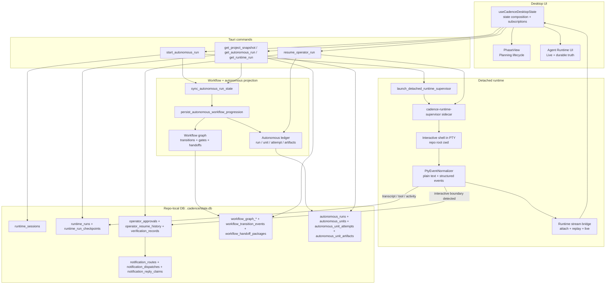
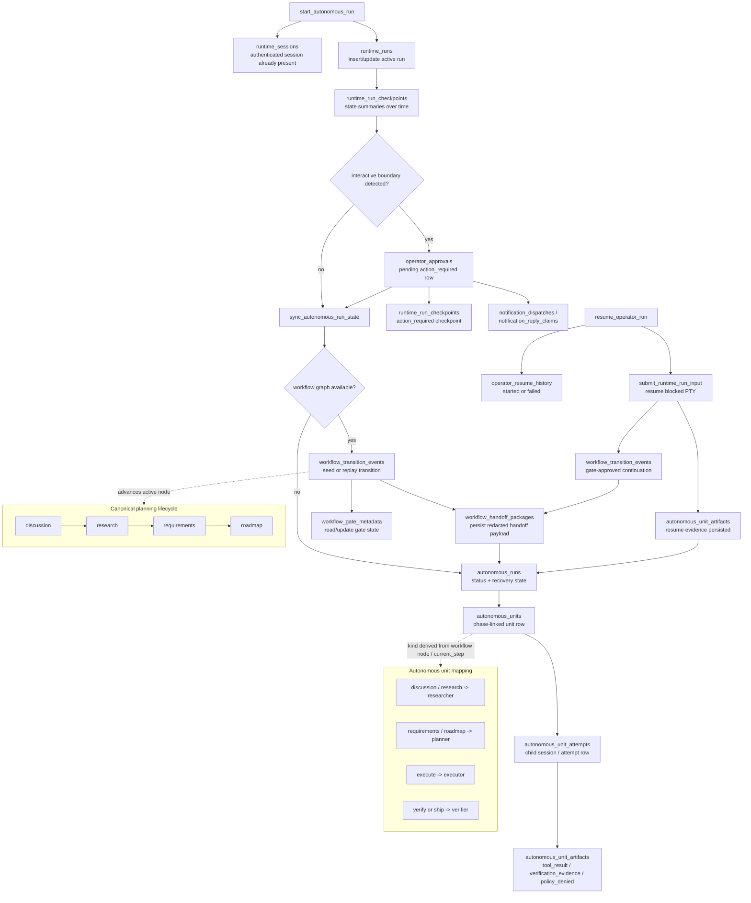

# CURRENT_ARCHITECTURE

This document describes the **current** agentic architecture implemented under `client/`.

## Short version

The agentic system in `client/` is **not** a single in-process “agent brain.” It is four layers working together:

1. **A desktop UI + frontend state model**
   - React/Tauri frontend in `client/src/` and `client/components/`
2. **A detached shell supervisor**
   - Rust sidecar that runs an interactive shell in a PTY and normalizes output into structured events
3. **A workflow/lifecycle engine**
   - Workflow graph nodes, transitions, gates, and handoff packages
4. **A durable autonomous ledger**
   - A second projection over the runtime run that tracks autonomous units, attempts, workflow linkage, and artifacts

The most important architectural truth is this:

> `start_autonomous_run` launches the **same detached PTY runtime** as `start_runtime_run`.
> What makes it “autonomous” is the extra **autonomous projection + workflow progression + artifact persistence** layered on top of that runtime.

A second key truth:

> `client/` currently **does not define phase-specific system prompt text** for the agent.
> It defines the **runtime/supervision contract**, the **workflow phase mapping**, the **handoff payload**, and the **durable database model**.

---

## 1. Main architecture chart

## 1.1 DB writes + phase transition chart

---

## 2. What the system actually is

### 2.1 It is shell-supervised, not prompt-authored here

The runtime path launches a shell selected from `SHELL` / `COMSPEC`, with platform defaults:

- macOS/Linux: `/bin/sh -i`
- Windows: `cmd.exe /Q`

Relevant files:

- `client/src-tauri/src/commands/start_autonomous_run.rs`
- `client/src-tauri/src/commands/start_runtime_run.rs`
- `client/src-tauri/src/runtime/platform_adapter.rs`
- `client/src-tauri/src/runtime/supervisor.rs`

That means `client/` is primarily a:

- **runtime supervisor**
- **state machine / ledger**
- **phase/workflow orchestrator**
- **UI truth model**

It is **not** currently the place where phase-specific prompt text is authored.

### 2.2 “Autonomous” is a durable projection over the runtime

The autonomous layer is derived from the runtime snapshot and workflow state:

- runtime truth comes from `runtime_runs` + `runtime_run_checkpoints`
- autonomous truth comes from `autonomous_runs`, `autonomous_units`, `autonomous_unit_attempts`, and `autonomous_unit_artifacts`
- workflow truth comes from `workflow_graph_nodes`, `workflow_graph_edges`, `workflow_gate_metadata`, `workflow_transition_events`, and `workflow_handoff_packages`

The bridge between them is:

- `sync_autonomous_run_state(...)`
- `reconcile_runtime_snapshot(...)`
- `persist_autonomous_workflow_progression(...)`

Relevant files:

- `client/src-tauri/src/commands/runtime_support.rs`
- `client/src-tauri/src/runtime/autonomous_orchestrator.rs`
- `client/src-tauri/src/runtime/autonomous_workflow_progression.rs`

### 2.3 The UI intentionally merges live truth with durable truth

The frontend does **not** trust the live stream alone.
It merges:

- live stream events
- durable approvals
- durable resume history
- durable autonomous artifacts
- durable workflow linkage and handoff packages

So the UI can keep showing the last truthful state after the live stream drops.

Relevant files:

- `client/src/features/cadence/use-cadence-desktop-state.ts`
- `client/src/features/cadence/agent-runtime-projections.ts`
- `client/src/lib/cadence-model.ts`
- `client/components/cadence/agent-runtime.tsx`

---

## 3. Step by step: what happens when an autonomous run starts

### Step 1: the frontend requests an autonomous run

The frontend eventually calls the Tauri command:

- `start_autonomous_run(projectId)`

Entry point:

- `client/src-tauri/src/commands/start_autonomous_run.rs`

### Step 2: Cadence resolves the repo and checks for an existing reachable run

`start_autonomous_run` does this first:

1. validate `projectId`
2. resolve the repo root
3. load the persisted runtime run snapshot
4. probe the current runtime supervisor endpoint
5. if an existing reachable run is already active, **do not launch another one**
6. instead, return `sync_autonomous_run_state(..., DuplicateStart)`

That duplicate-start path is important. The system is intentionally **idempotent per project**.

### Step 3: runtime auth must be ready

Before launching a run, the runtime session must already be authenticated.

`ensure_runtime_run_auth_ready(...)` allows only:

- `authenticated`

and blocks:

- `idle`
- `starting`
- `awaiting_browser_callback`
- `awaiting_manual_input`
- `exchanging_code`
- `refreshing`
- `cancelled`
- `failed`

Relevant files:

- `client/src-tauri/src/commands/start_runtime_run.rs`
- `client/src-tauri/src/commands/runtime_support.rs`
- `client/src-tauri/src/commands/mod.rs`

### Step 4: Cadence chooses a shell

The runtime does **not** choose a phase-specific prompt template here.
It chooses a shell program and arguments.

Shell resolution comes from:

- `resolve_runtime_shell_selection()`

Rules:

- prefer `SHELL` or `COMSPEC` if valid
- otherwise fall back to `/bin/sh -i` or `cmd.exe /Q`

Relevant file:

- `client/src-tauri/src/runtime/platform_adapter.rs`

### Step 5: the detached supervisor sidecar is launched

The host launches `cadence-runtime-supervisor` as a separate process.

The launch request includes:

- `project_id`
- `repo_root`
- `runtime_kind`
- `run_id`
- `session_id`
- `flow_id`
- shell `program`
- shell `args`

Relevant file:

- `client/src-tauri/src/runtime/supervisor.rs`

### Step 6: the sidecar initializes the PTY runtime

Inside `run_supervisor_sidecar(...)`, the sidecar:

1. binds a local TCP control listener
2. allocates a PTY
3. spawns the selected shell inside that PTY with `cwd = repo_root`
4. takes exclusive ownership of the PTY writer
5. persists the initial `runtime_runs` row
6. emits a `Ready` startup handshake back to the host
7. starts:
   - control listener thread
   - PTY reader thread
   - heartbeat thread

This is the runtime substrate for both supervised and autonomous runs.

Relevant files:

- `client/src-tauri/src/runtime/protocol.rs`
- `client/src-tauri/src/runtime/supervisor.rs`

### Step 7: the host validates the handshake and persists runtime state

The host receives `SupervisorStartupMessage::Ready` and validates:

- protocol version
- project id
- run id
- transport kind
- endpoint

Then it persists / reloads the durable runtime snapshot and emits `runtime_run_updated` to the frontend.

Relevant files:

- `client/src-tauri/src/runtime/protocol.rs`
- `client/src-tauri/src/runtime/supervisor.rs`
- `client/src-tauri/src/commands/runtime_support.rs`

### Step 8: Cadence creates or updates the autonomous projection

Immediately after launch, `start_autonomous_run` calls:

- `sync_autonomous_run_state(..., Observe)`

That does two things:

1. `reconcile_runtime_snapshot(...)`
   - turns runtime state into an `AutonomousRunUpsertRecord`
2. `persist_autonomous_workflow_progression(...)`
   - aligns the autonomous run with the workflow graph

Relevant files:

- `client/src-tauri/src/commands/runtime_support.rs`
- `client/src-tauri/src/runtime/autonomous_orchestrator.rs`
- `client/src-tauri/src/runtime/autonomous_workflow_progression.rs`

### Step 9: workflow progression may seed or replay transitions

If the project has a workflow graph, Cadence will:

1. load the active workflow node
2. resolve or derive workflow linkage
3. seed the initial transition if the active node is a seedable discussion node
4. replay automatic continuation transitions when possible
5. assemble or load workflow handoff packages
6. persist the autonomous run/unit/attempt with workflow linkage

There is a hard safety cap:

- `MAX_PROGRESSION_STEPS = 16`

So automatic progression cannot loop forever.

Relevant file:

- `client/src-tauri/src/runtime/autonomous_workflow_progression.rs`

### Step 10: the frontend reads state and re-syncs again on read

This is another important design choice.

Both of these commands re-probe runtime state and re-sync autonomous state on read:

- `get_autonomous_run`
- `get_project_snapshot`

That means the frontend read path is also a **repair / reconciliation path**.

Relevant files:

- `client/src-tauri/src/commands/get_autonomous_run.rs`
- `client/src-tauri/src/commands/get_project_snapshot.rs`
- `client/src-tauri/src/commands/get_runtime_run.rs`

---

## 4. How the live runtime stream works

### 4.1 The detached supervisor exposes a TCP control protocol

The live bridge is not reading the PTY directly from the frontend.
It uses a TCP control protocol with requests like:

- `Probe`
- `Stop`
- `Attach`
- `SubmitInput`

and responses like:

- `ProbeResult`
- `Attached`
- `SubmitInputAccepted`
- `Event`
- `Error`

Relevant file:

- `client/src-tauri/src/runtime/protocol.rs`

### 4.2 PTY output is normalized into structured runtime items

The sidecar converts PTY output into normalized live events.

There are two sources:

#### A. Plain shell output

Plain text becomes:

- `Transcript`

#### B. Structured shell output

If the child process prints a line prefixed with:

- `__CADENCE_EVENT__ `

then the supervisor parses it as structured JSON and can emit:

- `Transcript`
- `Tool`
- `Activity`

Relevant file:

- `client/src-tauri/src/runtime/supervisor.rs`

This is the runtime contract for agent/tool-aware child sessions.

### 4.3 Interactive prompts are detected heuristically

Cadence also watches incomplete PTY fragments for prompt-like output.

If the pending fragment:

- is short enough
- ends like a prompt (`:`, `?`, `>`, `]`, `)`)
- contains prompt-like keywords (`enter`, `input`, `provide`, `password`, `token`, `continue`, `confirm`, `approve`, `select`, etc.)

then it becomes an `ActionRequired` boundary.

Default boundary metadata:

- action type: `terminal_input_required`
- title: `Terminal input required`
- detail: `Detached runtime is blocked on terminal input. Approve and resume with a coarse operator answer to continue the same supervised run.`

Relevant file:

- `client/src-tauri/src/runtime/supervisor.rs`

### 4.4 The stream bridge replays buffered events and fills gaps from durable approvals

`stream.rs` does the frontend bridge.
It:

1. validates session identity
2. loads the current durable runtime run
3. loads pending approvals from the project snapshot
4. attaches to the sidecar endpoint
5. replays buffered events first
6. keeps streaming live events
7. injects pending durable approvals as `action_required` items if needed
8. emits a terminal `complete` or `failure` item when the run ends

Relevant file:

- `client/src-tauri/src/runtime/stream.rs`

### 4.5 The live buffer is intentionally bounded

Important limits from the current code:

- sidecar live event ring: `128`
- frontend maximum runtime stream items: `40`
- transcript subset: `20`
- tool subset: `20`
- activity subset: `20`
- action-required subset: `10`

Relevant files:

- `client/src-tauri/src/runtime/supervisor.rs`
- `client/src/lib/cadence-model.ts`

---

## 5. How the phases work

There are **three different “phase” models** in this system.
They are related, but they are not the same thing.

### 5.1 Planning lifecycle stages

These are the canonical lifecycle stages shown in `PhaseView`:

1. `discussion`
2. `research`
3. `requirements`
4. `roadmap`

They are derived from workflow graph node ids, not from prompt text.

A stage is marked `actionRequired` if any gate for that node is:

- `pending`
- `blocked`

The lifecycle stage order is fixed and canonical.

Relevant files:

- `client/components/cadence/phase-view.tsx`
- `client/src/lib/cadence-model.ts`
- `client/src-tauri/src/db/project_store.rs`

### 5.2 Workflow graph steps

Workflow graph nodes also have `current_step`, which can be:

- `discuss`
- `plan`
- `execute`
- `verify`
- `ship`

This is a lower-level execution axis than the planning lifecycle.

Relevant files:

- `client/src-tauri/src/db/project_store.rs`
- `client/src-tauri/src/commands/mod.rs`

### 5.3 Autonomous unit kinds

The autonomous ledger tracks units as one of:

- `researcher`
- `planner`
- `executor`
- `verifier`

The mapping rules are:

| Source | Rule | Autonomous unit kind |
|---|---|---|
| Recognized lifecycle node | `discussion` or `research` | `researcher` |
| Recognized lifecycle node | `requirements` or `roadmap` | `planner` |
| Non-lifecycle node `current_step` | `discuss` | `researcher` |
| Non-lifecycle node `current_step` | `plan` | `planner` |
| Non-lifecycle node `current_step` | `execute` | `executor` |
| Non-lifecycle node `current_step` | `verify` or `ship` | `verifier` |

Important nuance:

> Lifecycle node classification happens first.
> So canonical planning lifecycle nodes currently map only to **Researcher** and **Planner**.
> `Executor` and `Verifier` come from non-lifecycle workflow nodes that expose `current_step = execute/verify/ship`.

Relevant file:

- `client/src-tauri/src/runtime/autonomous_workflow_progression.rs`

### 5.4 Runtime stream item kinds

The live stream has its own item kinds:

- `transcript`
- `tool`
- `activity`
- `action_required`
- `complete`
- `failure`

Relevant files:

- `client/src-tauri/src/commands/mod.rs`
- `client/src-tauri/src/runtime/stream.rs`
- `client/src/lib/cadence-model.ts`

### 5.5 Phase rollover behavior

When workflow progression changes stage/linkage:

- if the workflow linkage is effectively the same, Cadence **reuses** the current autonomous unit/attempt
- if the workflow linkage changes, Cadence **creates a new autonomous unit and a new attempt**
- superseded open units/attempts are closed during persistence

This is how the system builds durable autonomous history.

Relevant file:

- `client/src-tauri/src/runtime/autonomous_workflow_progression.rs`

---

## 6. System prompts used during each phase

## Direct answer

Within `client/` today, there are **no phase-specific system prompt strings** for:

- discussion
- research
- requirements
- roadmap
- researcher
- planner
- executor
- verifier

I explicitly checked the current `client/` code for prompt sources and did **not** find in-repo prompt text or prompt templates under:

- `client/src-tauri/`
- `client/src/`
- `client/components/`
- `client/app/`

That includes searches for:

- `system prompt`
- `system_prompt`
- `prompt template`
- `AGENTS.md`
- `SKILL.md`
- `You are ...`

### What `client/` does define instead

#### 1. A shell launch contract

The agent runtime is launched as a shell process in a PTY.

Files:

- `client/src-tauri/src/commands/start_autonomous_run.rs`
- `client/src-tauri/src/runtime/platform_adapter.rs`
- `client/src-tauri/src/runtime/supervisor.rs`

#### 2. A structured event contract

A child runtime can emit structured tool/activity/transcript events by printing:

- `__CADENCE_EVENT__ { ... }`

File:

- `client/src-tauri/src/runtime/supervisor.rs`

#### 3. A workflow handoff payload

This is the closest thing to persisted per-phase instruction/context.
The handoff package stores:

- trigger transition metadata
- destination node state
- lifecycle projection snapshot
- pending gate actions
- latest resume metadata

It is persisted as `workflow_handoff_packages.package_payload`.

Files:

- `client/src-tauri/src/db/project_store.rs`
- `client/src-tauri/src/runtime/autonomous_workflow_progression.rs`

#### 4. A repo-local autonomous tool runtime contract

`client/` includes a repo-local tool runtime with these tool names:

- `read`
- `search`
- `edit`
- `write`
- `command`

But this is an important caveat:

> The current `start_autonomous_run` launch path does **not** instantiate `AutonomousToolRuntime`.
> In the current codebase it is exported and tested, but not wired into the actual autonomous launch path.

Relevant files:

- `client/src-tauri/src/runtime/autonomous_tool_runtime.rs`
- `client/src-tauri/src/runtime/mod.rs`

#### 5. Operator-facing checkpoint strings

The runtime does contain durable operator-boundary copy, for example:

- `Terminal input required`
- `Detached runtime is blocked on terminal input...`

But those are **not** system prompts for a child agent.
They are operator-facing boundary metadata.

### What this means in practice

The actual prompt layer is likely outside `client/`, in one of these places:

- the external runtime/provider (`openai_codex`)
- the shell-launched child program
- repo/user-level agent configuration outside `client/`

`client/` supervises, normalizes, persists, and visualizes the agentic loop.
It does not currently author the per-phase prompt text for that loop.

---

## 7. Closest thing to a per-phase instruction payload: workflow handoff packages

When Cadence advances workflow state, it can assemble a handoff package.
This payload is the best representation of what phase-specific context currently exists inside `client/`.

### Persisted structure

`WorkflowHandoffPackagePayload` contains:

- `schemaVersion`
- `triggerTransition`
- `destinationState`
- `lifecycleProjection`
- `operatorContinuity`

### What each section carries

#### `triggerTransition`

- transition id
- causal transition id
- from node id
- to node id
- transition kind
- gate decision
- whether gate decision context exists
- transition timestamp

#### `destinationState`

- destination node id
- phase id
- sort order
- node name / description
- node status
- current step
- task counts
- pending gate count
- destination gate metadata

Important redaction behavior:

- gate `detail` is not inlined here
- decision context is not inlined here
- only presence booleans like `detailPresent` / `decisionContextPresent` are carried

#### `lifecycleProjection`

- the ordered lifecycle stage list
- each stage includes stage kind, node id, status, action-required flag, and last transition time

#### `operatorContinuity`

- pending gate action count
- pending gate actions for the destination transition
- latest matching resume row if one exists

### Why this matters

This is the phase-to-phase context object that the architecture persists today.
If the system later adds explicit phase prompts, this payload is the natural place those prompts would be derived from.

Relevant file:

- `client/src-tauri/src/db/project_store.rs`

---

## 8. What gets saved to the database along the way

## Database location

The repo-local database lives at:

- `<repo>/.cadence/state.db`

Source:

- `client/src-tauri/src/db/mod.rs`

## Important design rule

The system intentionally stores **redacted / structured truth**, not raw secret-bearing transcript data.
Many persistence paths reject or redact content that looks secret-bearing.

### 8.1 Runtime auth state

**Table:** `runtime_sessions`

Saved fields include:

- `project_id`
- `runtime_kind`
- `provider_id`
- `flow_id`
- `session_id`
- `account_id`
- `auth_phase`
- `last_error_code`
- `last_error_message`
- `last_error_retryable`
- timestamps

When written:

- during auth reconciliation / auth lifecycle changes

Relevant files:

- `client/src-tauri/src/commands/runtime_support.rs`
- `client/src-tauri/src/db/project_store.rs`
- `client/src-tauri/src/db/migrations.rs`

### 8.2 Runtime run state

**Tables:**

- `runtime_runs`
- `runtime_run_checkpoints`

Saved in `runtime_runs`:

- `run_id`
- `runtime_kind`
- `supervisor_kind`
- `status`
- `transport_kind`
- `transport_endpoint`
- `transport_liveness`
- `last_checkpoint_sequence`
- `started_at`
- `last_heartbeat_at`
- `last_checkpoint_at`
- `stopped_at`
- `last_error_code`
- `last_error_message`
- `updated_at`

Saved in `runtime_run_checkpoints`:

- `project_id`
- `run_id`
- `sequence`
- `kind`
- `summary`
- `created_at`

When written:

- sidecar startup
- heartbeats / probe refreshes
- runtime status changes
- persisted live-event summaries
- action-required checkpoints
- terminal exit

Important nuance:

- current sidecar checkpoint persistence primarily writes `state` summaries plus explicit `action_required` checkpoints
- the checkpoint enum supports `bootstrap`, `state`, `tool`, `action_required`, `diagnostic`, but current live-event persistence path mostly uses `state`

Relevant files:

- `client/src-tauri/src/runtime/supervisor.rs`
- `client/src-tauri/src/db/project_store.rs`
- `client/src-tauri/src/db/migrations.rs`

### 8.3 Interactive boundary / operator loop state

**Tables:**

- `operator_approvals`
- `operator_resume_history`
- `operator_verification_records`

Saved in `operator_approvals`:

- `action_id`
- `session_id`
- `flow_id`
- `action_type`
- `title`
- `detail`
- `status`
- `decision_note`
- `user_answer`
- timestamps
- optional gate linkage fields:
  - `gate_node_id`
  - `gate_key`
  - `transition_from_node_id`
  - `transition_to_node_id`
  - `transition_kind`

When written:

- when a runtime interactive boundary is detected
- when a workflow gate creates an operator action
- when an operator approves/rejects a request

Saved in `operator_resume_history`:

- `source_action_id`
- `session_id`
- `status` (`started` / `failed`)
- `summary`
- `created_at`

When written:

- after a resume attempt is made

Saved in `operator_verification_records`:

- `source_action_id`
- `status`
- `summary`
- `detail`
- `recorded_at`

When written:

- for verification-oriented operator flows outside the raw PTY resume path

Relevant files:

- `client/src-tauri/src/runtime/supervisor.rs`
- `client/src-tauri/src/commands/resume_operator_run.rs`
- `client/src-tauri/src/db/project_store.rs`
- `client/src-tauri/src/db/migrations.rs`

### 8.4 Notification fan-out state

**Tables:**

- `notification_routes`
- `notification_dispatches`
- `notification_reply_claims`

Saved in `notification_routes`:

- route kind / target
- enabled flag
- non-secret metadata

Saved in `notification_dispatches`:

- `action_id`
- `route_id`
- `correlation_key`
- `status`
- `attempt_count`
- `last_attempt_at`
- `delivered_at`
- `claimed_at`
- `last_error_code`
- `last_error_message`

Saved in `notification_reply_claims`:

- `action_id`
- `route_id`
- `correlation_key`
- `responder_id`
- `reply_text`
- `status`
- rejection code/message

When written:

- after a pending operator action is persisted and fan-out is attempted
- when remote replies are claimed / rejected

Important nuance:

- route credentials are intentionally **not** stored in the repo-local state DB; those live in app-local notification credential storage

Relevant files:

- `client/src-tauri/src/runtime/supervisor.rs`
- `client/src-tauri/src/notifications/*`
- `client/src-tauri/src/db/project_store.rs`
- `client/src-tauri/src/db/migrations.rs`

### 8.5 Workflow / planning lifecycle state

**Tables:**

- `workflow_graph_nodes`
- `workflow_graph_edges`
- `workflow_gate_metadata`
- `workflow_transition_events`
- `workflow_handoff_packages`

Saved in `workflow_graph_nodes`:

- node id
- phase id
- sort order
- name / description
- status
- `current_step`
- task counts
- summary

Saved in `workflow_graph_edges`:

- from / to node ids
- transition kind
- gate requirement

Saved in `workflow_gate_metadata`:

- gate key / gate state
- action type
- title / detail
- decision context

Saved in `workflow_transition_events`:

- `transition_id`
- `causal_transition_id`
- from / to node ids
- transition kind
- gate decision
- gate decision context
- timestamp

Saved in `workflow_handoff_packages`:

- `handoff_transition_id`
- `causal_transition_id`
- from / to node ids
- transition kind
- `package_payload`
- `package_hash`
- timestamp

When written:

- when workflow graph state is created/updated
- when a gate is satisfied/rejected/blocked
- when automatic dispatch advances workflow state
- when a handoff package is assembled or replayed

Relevant files:

- `client/src-tauri/src/db/project_store.rs`
- `client/src-tauri/src/runtime/autonomous_workflow_progression.rs`
- `client/src-tauri/src/db/migrations.rs`

### 8.6 Autonomous projection state

**Tables:**

- `autonomous_runs`
- `autonomous_units`
- `autonomous_unit_attempts`
- `autonomous_unit_artifacts`

Saved in `autonomous_runs`:

- `run_id`
- `runtime_kind`
- `supervisor_kind`
- `status`
- `active_unit_sequence`
- duplicate-start flags / reason
- lifecycle timestamps (`paused_at`, `cancelled_at`, `completed_at`, `crashed_at`, `stopped_at`)
- pause/cancel/crash reason codes + messages
- `last_error_code`
- `last_error_message`
- `updated_at`

Saved in `autonomous_units`:

- `unit_id`
- `sequence`
- `kind` (`researcher` / `planner` / `executor` / `verifier`)
- `status`
- `summary`
- `boundary_id`
- workflow linkage:
  - `workflow_node_id`
  - `workflow_transition_id`
  - `workflow_causal_transition_id`
  - `workflow_handoff_transition_id`
  - `workflow_handoff_package_hash`
- timestamps
- `last_error_*`

Saved in `autonomous_unit_attempts`:

- `attempt_id`
- `attempt_number`
- `child_session_id`
- `status`
- `boundary_id`
- same workflow linkage fields
- timestamps
- `last_error_*`

Saved in `autonomous_unit_artifacts`:

- `artifact_id`
- `artifact_kind`
- `status`
- `summary`
- `content_hash`
- `payload_json`
- timestamps

Structured artifact payload kinds currently include:

- `tool_result`
- `verification_evidence`
- `policy_denied`

When written:

- immediately after autonomous sync from runtime snapshot
- after workflow progression
- after structured tool events
- after blocked action-required boundaries
- after resume evidence is persisted
- after policy-denied activity events

Relevant files:

- `client/src-tauri/src/runtime/autonomous_orchestrator.rs`
- `client/src-tauri/src/runtime/autonomous_workflow_progression.rs`
- `client/src-tauri/src/db/project_store.rs`
- `client/src-tauri/src/db/migrations.rs`

### 8.7 What is intentionally **not** persisted as raw truth

Cadence is deliberately conservative here.

Notably:

- full raw live transcript is **not** the main durable truth surface
- secret-bearing text is rejected/redacted from many persistence paths
- workflow handoff packages store **redacted context metadata**, not full raw gate details
- structured autonomous artifact payloads are hash-checked for integrity

This is why the system prefers:

- summaries
- typed diagnostics
- linkage metadata
- bounded structured artifacts

instead of dumping raw prompt/session material into SQLite.

---

## 9. Read-side truth model used by the UI

When the frontend loads a project, it assembles truth from several sources:

### Project snapshot

`get_project_snapshot` returns:

- project summary
- repository summary
- phases
- lifecycle projection
- approval requests
- verification records
- resume history
- handoff packages
- autonomous run / unit (after sync)

### Runtime run

`get_runtime_run` returns:

- runtime status
- transport state
- checkpoints
- diagnostics

### Autonomous run

`get_autonomous_run` returns:

- autonomous run
- current unit
- current attempt
- bounded history

### Live stream

Runtime stream subscription adds:

- transcript rows
- tool rows
- activity rows
- action-required rows
- complete/failure rows

### UI merge behavior

The UI then composes:

- planning lifecycle cards (`PhaseView`)
- agent runtime + checkpoint control loop (`agent-runtime.tsx`)
- recent autonomous history cards
- workflow linkage / handoff context
- trust snapshots based on runtime + routes + broker state

Relevant files:

- `client/src/features/cadence/use-cadence-desktop-state.ts`
- `client/src/features/cadence/agent-runtime-projections.ts`
- `client/src/lib/cadence-model.ts`
- `client/components/cadence/phase-view.tsx`
- `client/components/cadence/agent-runtime.tsx`

---

## 10. Important current architectural conclusions

### Conclusion 1: “Autonomous” is currently orchestration + persistence, not a distinct prompt engine

The runtime layer launches a shell.
The autonomous layer interprets and persists that shell-backed run as:

- workflow-linked units
- attempts
- artifacts
- operator checkpoints

### Conclusion 2: phase identity is workflow-derived, not prompt-derived

The current phase system is defined by:

- workflow node ids
- workflow `current_step`
- workflow transitions and gates

not by prompt templates stored in `client/`.

### Conclusion 3: the system is designed around durable recovery

The architecture keeps enough durable state to recover after reload/restart:

- runtime run status
- approvals
- resume history
- workflow transitions
- handoff packages
- autonomous unit history
- structured artifacts

### Conclusion 4: the repo-local autonomous tool runtime exists, but is not yet the main launch-path runtime

`AutonomousToolRuntime` is real and tested, but the current autonomous launch path does not instantiate it.
So the current implementation is still primarily **shell-supervised**.

### Conclusion 5: the UI is intentionally “last truthful state wins”

When the live stream and durable snapshot disagree, the frontend tries to preserve the last truthful durable state rather than clear the UI aggressively.
That is visible in:

- checkpoint control loop projections
- durable history fallback
- route/load error preservation

---

## 11. Primary source files

### Entry points

- `client/src-tauri/src/commands/start_autonomous_run.rs`
- `client/src-tauri/src/commands/start_runtime_run.rs`
- `client/src-tauri/src/commands/get_project_snapshot.rs`
- `client/src-tauri/src/commands/get_autonomous_run.rs`
- `client/src-tauri/src/commands/get_runtime_run.rs`
- `client/src-tauri/src/commands/resume_operator_run.rs`

### Runtime core

- `client/src-tauri/src/runtime/protocol.rs`
- `client/src-tauri/src/runtime/supervisor.rs`
- `client/src-tauri/src/runtime/stream.rs`
- `client/src-tauri/src/runtime/platform_adapter.rs`
- `client/src-tauri/src/runtime/autonomous_orchestrator.rs`
- `client/src-tauri/src/runtime/autonomous_workflow_progression.rs`
- `client/src-tauri/src/runtime/autonomous_tool_runtime.rs`

### Database / persistence

- `client/src-tauri/src/db/mod.rs`
- `client/src-tauri/src/db/migrations.rs`
- `client/src-tauri/src/db/project_store.rs`

### Frontend truth model / UI

- `client/src/lib/cadence-model.ts`
- `client/src/features/cadence/use-cadence-desktop-state.ts`
- `client/src/features/cadence/agent-runtime-projections.ts`
- `client/components/cadence/phase-view.tsx`
- `client/components/cadence/agent-runtime.tsx`

---

## 12. One-sentence summary

`client/` currently implements a **shell-supervised, workflow-linked, database-backed agent runtime** where autonomous behavior is modeled as a durable projection over a detached PTY run, but **phase-specific system prompts are not authored inside this subsystem**.
