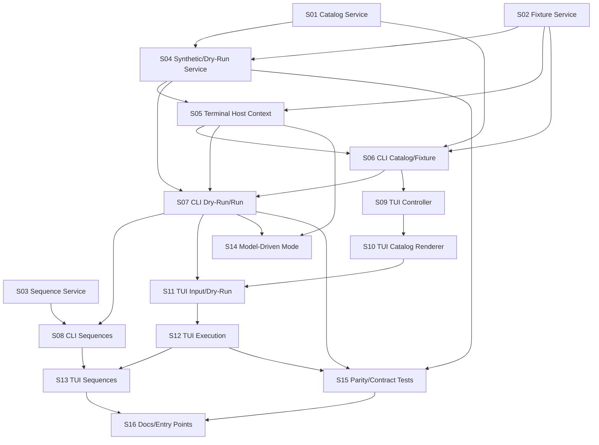

# TUI Harness Expansion Plan

## Reader And Action

This plan is for internal Xero engineers and coding agents implementing a terminal version of the developer tool harness. After reading it, a contributor should be able to pick an unblocked slice, understand the owned code area, implement it without adding temporary UI, and verify it with scoped tests.

The target outcome is one shared developer tool harness available through both the existing desktop settings UI and a new terminal interface. The terminal interface should support catalog browsing, fixture preparation, dry-runs, synthetic tool calls, saved multi-call sequences, and eventually model-driven tool exercise mode.

## Scope

In scope:

- Extract reusable harness behavior from the desktop command layer.
- Add a terminal runtime context that uses OS app-data state and project registry data.
- Add scriptable CLI commands for catalog, fixture, dry-run, run, and sequence operations.
- Add a TUI for interactive catalog browsing, input editing, dry-run inspection, execution, and sequence management.
- Preserve existing desktop UI behavior while broadening the shared service underneath it.
- Add focused unit and integration coverage for the service, CLI commands, and TUI controller.

Out of scope for the first implementation:

- Browser-opening validation.
- Temporary debug/test UI.
- Repo-local `.xero` state.
- Full parity for desktop-only tools that require Tauri-managed browser, emulator, or app state.
- Multi-agent pipeline behavior. This plan concerns the developer tool harness, not a future workflow system.

## Current Harness Capabilities To Preserve

The existing harness already provides more than the visible desktop panel exposes:

- Tool catalog metadata: schema, description, group, tags, examples, risk/effect class, host availability, allowed runtime agents, activation groups, and tool packs.
- Fixture project provisioning under OS app data.
- Synthetic dispatch for one or more tool calls.
- Write approval and operator approval toggles.
- Dry-run policy and sandbox inspection.
- Saved sequence persistence in the global app-data database.
- Template chaining between synthetic calls with prior call outputs.
- Model-driven harness runs through the desktop runtime.
- Contract export and drift tests for prompts, tool registries, agent access, and tool surfaces.

The TUI should expand access to these capabilities instead of duplicating only the current list-and-run panel.

## Architecture Direction

Build a shared harness service first, then attach two frontends:

- Desktop frontend: existing React/Tauri command surface remains the user-facing UI.
- Terminal frontend: new CLI/TUI path calls the same shared service.

The service should own core harness operations:

- Catalog generation.
- Fixture preparation.
- Synthetic execution.
- Dry-run inspection.
- Sequence list/save/delete.
- Runtime availability classification.

The host layer should supply environment-specific dependencies:

- App-data root.
- Global database path.
- Project registry lookup.
- Skill cache/settings roots.
- Optional browser, emulator, Solana, and model-run executors.

This keeps desktop-only integrations explicit and makes the terminal path honest about unavailable capabilities.

## Milestones

### M1: Shared Harness Service

Goal: Make harness behavior reusable without changing existing desktop behavior.

Deliverables:

- A service module with pure request/response methods for catalog, fixture, dry-run, synthetic run, and sequence persistence.
- Thin Tauri command wrappers that delegate to the service.
- Tests proving the desktop command outputs remain compatible.

Exit criteria:

- Existing desktop harness tests pass.
- Service tests cover fixture setup, catalog output, sequence persistence, and empty-call validation.
- No user-facing desktop behavior changes except internal reliability improvements.

### M2: Terminal Host And Batch CLI

Goal: Provide non-interactive terminal commands that exercise the same service.

Deliverables:

- Terminal host configuration that resolves app-data root, global database path, and fixture project.
- Batch CLI commands for catalog, fixture, dry-run, run, and sequences.
- JSON output mode for every command.
- Text output mode suitable for humans and smoke tests.

Exit criteria:

- A terminal user can prepare the fixture, list tools, dry-run a tool, run a tool, and inspect/save/delete sequences without opening the desktop app.
- Desktop-only tools are clearly marked unavailable rather than failing mysteriously.

### M3: TUI Shell And Navigation

Goal: Create the first interactive terminal harness experience.

Deliverables:

- TUI app state and reducer/controller independent of terminal rendering.
- Catalog browser with filtering, grouping, and detail panel.
- Keybindings for search, group filter, JSON input edit, dry-run, run, and quit.
- Deterministic controller tests with no real terminal required.

Exit criteria:

- `tool-harness tui` opens an interactive catalog.
- Users can inspect metadata and choose a tool.
- Controller tests cover navigation, filtering, selection, and unavailable-tool states.

### M4: TUI Execution Path

Goal: Let the TUI safely run real harness operations.

Deliverables:

- JSON input synthesis from tool schemas.
- External editor editing for JSON input.
- Dry-run policy/sandbox result panel.
- Synthetic execution result panel.
- Approval toggle handling with explicit status.

Exit criteria:

- Users can select a tool, edit input, dry-run it, run it, and inspect output.
- Invalid JSON, policy denial, sandbox denial, and tool failure are shown as first-class states.

### M5: Sequence Authoring And Replay

Goal: Bring the hidden sequence system into both CLI and TUI workflows.

Deliverables:

- Multi-call sequence builder in TUI.
- Sequence save/load/delete actions.
- Template chaining help and validation.
- CLI sequence run support.

Exit criteria:

- Users can build a multi-call sequence, save it, reload it, and replay it.
- Template errors point to the failing call and token.
- Stored sequence state lives only under app-data storage.

### M6: Model-Driven Harness Mode

Goal: Add terminal-compatible support for model-driven tool exercise mode.

Deliverables:

- A model-runner abstraction shared by desktop and terminal hosts.
- Desktop implementation preserving current behavior.
- Terminal implementation using the headless owned-agent runtime with explicit provider/model flags.
- Admission checks that reject fake-provider or real-provider misuse clearly.

Exit criteria:

- Desktop mode still works.
- Terminal mode can start a model-driven harness run when provider credentials and project state are configured.
- CI/default terminal mode does not accidentally launch real provider work without explicit flags.

### M7: Hardening, Docs, And Release Readiness

Goal: Make the TUI maintainable, testable, and safe to hand to other contributors.

Deliverables:

- Scoped verification scripts or documented commands.
- TUI help screen.
- Update developer docs or README entry points.
- Contract tests for catalog/runtime availability parity.
- Regression tests for app-data storage, approval handling, and unavailable desktop-only tools.

Exit criteria:

- New contributors can run the TUI and know which commands verify it.
- No repo-wide Rust test or format command is required for routine harness work.
- The plan's success criteria are demonstrably met.

## Slices

- [ ] **S01: Extract Catalog Service** `risk:medium` `depends:[]`
  > After this: both the desktop command and a direct service test can produce the same catalog response, including schemas, risk/effect class, activation groups, allowed agents, and tool packs.

  Build notes:
  - Move catalog assembly into a reusable service function.
  - Keep the existing desktop command as a compatibility wrapper.
  - Add tests for skill-tool filtering and host-unavailable tools.

- [ ] **S02: Extract Fixture Project Service** `risk:medium` `depends:[]`
  > After this: a service test can seed and register the harness fixture project under app data without calling a Tauri command.

  Build notes:
  - Parameterize app-data root and global database path.
  - Keep deterministic fixture files.
  - Keep all state out of `.xero`.

- [ ] **S03: Extract Sequence Persistence Service** `risk:low` `depends:[]`
  > After this: sequence list/save/delete works through a shared service and the desktop command wrappers still return the existing DTOs.

  Build notes:
  - Preserve the existing global database table.
  - Validate non-empty names and non-empty call arrays.
  - Add tests for create, update, list ordering, delete, and invalid payload handling.

- [ ] **S04: Extract Synthetic Run And Dry-Run Service** `risk:high` `depends:[S01,S02]`
  > After this: a service caller can dry-run or execute a synthetic tool call against the fixture project with the same persisted run semantics as the desktop command.

  Build notes:
  - Preserve multi-call execution, stop-on-failure, write approval, operator approval, and template resolution.
  - Keep Tauri command wrappers thin.
  - Add tests for empty calls, policy denial shape, sandbox denial shape, and failure summaries.

- [ ] **S05: Add Terminal Harness Host Context** `risk:high` `depends:[S02,S04]`
  > After this: terminal code can create a harness runtime from app-data paths and project registry data, with desktop-only executors absent by design.

  Build notes:
  - Define a host context struct for app-data root, global database path, fixture project id, and runtime capability flags.
  - Resolve project roots from the registry.
  - Mark browser/emulator/Tauri-state dependent tools unavailable with explainable metadata.

- [ ] **S06: Add Batch CLI Catalog And Fixture Commands** `risk:medium` `depends:[S01,S02,S05]`
  > After this: `catalog` and `fixture` terminal commands can prepare the harness and print either text or JSON output.

  Build notes:
  - Prefer a dedicated harness binary or command namespace that links the desktop crate while the service is still desktop-owned.
  - Support `--json`.
  - Add command parser tests and a smoke test using a temp app-data directory.

- [ ] **S07: Add Batch CLI Dry-Run And Run Commands** `risk:high` `depends:[S04,S05,S06]`
  > After this: a terminal user can pass JSON input to dry-run or run a selected tool and inspect structured output without opening the desktop app.

  Build notes:
  - Accept input via `--input-json`, `--input-file`, and stdin.
  - Add explicit approval flags for writes and operator approvals.
  - Reject unavailable tools before dispatch with a clear message.

- [ ] **S08: Add Batch CLI Sequence Commands** `risk:medium` `depends:[S03,S07]`
  > After this: terminal users can list, save, delete, and run named multi-call sequences.

  Build notes:
  - Use the same DTO shape as desktop sequence storage.
  - Support JSON import/export for sequences.
  - Cover template chaining success and failure in tests.

- [ ] **S09: Build TUI Controller And State Model** `risk:medium` `depends:[S06]`
  > After this: catalog navigation, filtering, selection, and status updates are testable without a terminal renderer.

  Build notes:
  - Keep controller logic independent of `ratatui`.
  - Model loading, ready, error, running, dry-run result, and run result states.
  - Test key transitions and filter behavior.

- [ ] **S10: Build TUI Catalog Renderer** `risk:medium` `depends:[S09]`
  > After this: `tui` opens a usable catalog browser with grouped tools, details, runtime availability, and help hints.

  Build notes:
  - Use a restrained terminal layout: catalog list, detail pane, input/result pane, footer.
  - Avoid one-off debug panels.
  - Add snapshot-style rendering tests where practical.

- [ ] **S11: Add TUI JSON Input Editing And Dry-Run** `risk:high` `depends:[S07,S10]`
  > After this: users can synthesize default input, edit it through their configured editor, dry-run it, and see policy/sandbox results.

  Build notes:
  - Validate JSON before service calls.
  - Keep external editor failures recoverable.
  - Display decode failures separately from policy/sandbox denials.

- [ ] **S12: Add TUI Synthetic Execution** `risk:high` `depends:[S11]`
  > After this: users can run a selected tool from the TUI and inspect per-call summaries, output JSON, run id, session id, and stopped-early/failure status.

  Build notes:
  - Reuse batch CLI execution plumbing.
  - Show approval toggle states before execution.
  - Make long output scrollable and copyable through terminal-native interactions.

- [ ] **S13: Add TUI Sequence Builder And Replay** `risk:medium` `depends:[S08,S12]`
  > After this: users can compose a multi-call sequence in the TUI, save it, reload it, and replay it.

  Build notes:
  - Add sequence list and current-sequence panes.
  - Provide minimal inline help for template chaining.
  - Validate call order and missing templates before run.

- [ ] **S14: Add Terminal Model-Driven Mode** `risk:high` `depends:[S05,S07]`
  > After this: terminal users can explicitly start a model-driven harness run through the headless owned-agent runtime when credentials and provider flags are present.

  Build notes:
  - Introduce a model-runner trait with desktop and terminal implementations.
  - Require explicit provider/model flags in terminal mode.
  - Keep fake-provider and real-provider admission rules clear and test-covered.

- [ ] **S15: Add Parity And Contract Tests** `risk:medium` `depends:[S04,S07,S12]`
  > After this: automated checks prove desktop and terminal catalog/service behavior stay aligned for shared capabilities.

  Build notes:
  - Compare service catalog output with desktop command wrapper output.
  - Assert terminal-unavailable tools are intentional and explained.
  - Include app-data storage assertions.

- [ ] **S16: Document And Wire Developer Entry Points** `risk:low` `depends:[S13,S15]`
  > After this: contributors know how to launch the TUI, run scoped tests, and choose safe verification commands.

  Build notes:
  - Add a short developer-facing entry from existing docs or README.
  - Document scoped Rust and frontend test commands.
  - Include the "one Cargo command at a time" operational note.

## Dependency Graph

## Parallel Work Guidance

Safe early parallel tracks:

- S01, S02, and S03 can start independently.
- Once S06 exists, S09 can start while S07 continues.
- S08 can proceed in parallel with S09/S10 after S03 and S07 land.

Avoid parallel edits in the same files unless ownership is explicit:

- Service extraction slices should own the shared service module and desktop command wrapper changes.
- CLI slices should own command parsing and terminal-host wiring.
- TUI slices should own controller, renderer, and TUI tests.
- Model-driven mode should wait until terminal host and batch execution boundaries are stable.

## Key Risks

- Desktop and terminal paths drift if service extraction is incomplete.
- Tauri-only runtime dependencies may leak into the terminal path.
- The TUI could hide policy/sandbox failures behind generic errors.
- Real-provider model-driven mode could run too easily without explicit user intent.
- Sequence templating can become difficult to debug without per-call validation.
- Large JSON outputs can make the terminal unusable without scrolling/truncation.

## Proof Strategy

Use scoped verification throughout:

- Frontend harness regression: run the existing tool harness component test when desktop UI wrappers change.
- Rust service coverage: run targeted harness service tests.
- CLI parser and smoke coverage: run targeted CLI/harness command tests with temp app-data.
- TUI controller coverage: test state transitions without a real terminal.
- TUI rendering coverage: snapshot or buffer assertions for main states.
- Manual smoke only at the terminal level: prepare fixture, list catalog, dry-run read, run read, save sequence, replay sequence.

Do not use browser-based validation for this work.

## Definition Of Done

- One shared harness service backs both desktop commands and terminal entry points.
- The terminal path uses OS app-data project state and never writes new state under `.xero`.
- Desktop-only capabilities are visibly unavailable in terminal mode with clear explanations.
- TUI supports catalog browsing, JSON input editing, dry-run, run, result inspection, sequence save/load/replay, and help.
- CLI supports scriptable equivalents for all core TUI operations.
- Approval toggles are explicit and covered by tests.
- Scoped tests and format checks pass.
- Developer docs explain how to run and verify the TUI harness.
