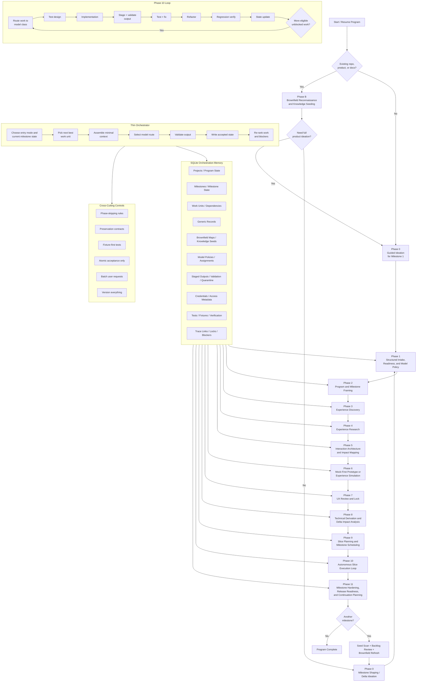
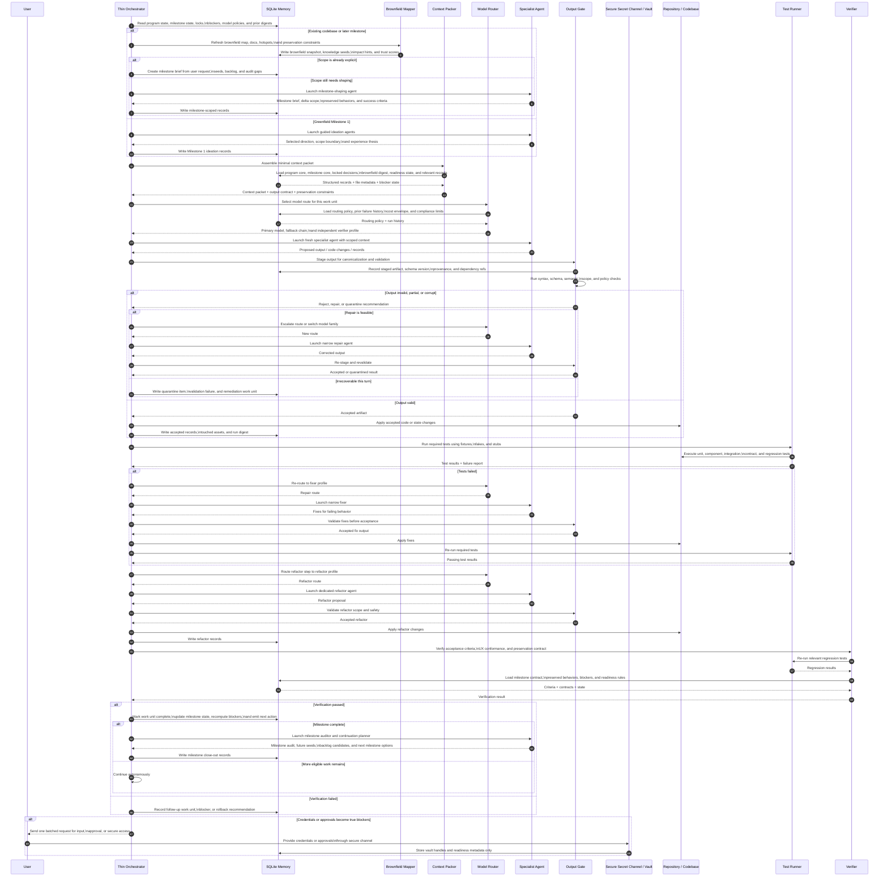

# Experience-First Agentic Delivery Pipeline
## Brownfield, Milestones, Smart Model Routing, and Fault-Containment Update

## Purpose

This design describes a structured, fresh-agent software delivery system inspired by GSD-style orchestration, but optimized for **outside-in building**: the team gets to a usable experience early, then derives the technical architecture from the approved experience instead of forcing the user to wait through long backend-heavy implementation before seeing anything tangible.

This revision expands the earlier design in five important ways:

1. It adds an **optional brownfield reconnaissance stage** that can scan an existing repository, ingest project documents, map constraints, and seed reusable knowledge before planning starts.
2. It adds a **first-class milestone model** so the initial project build becomes **Milestone 1**, and every later expansion runs as a new, delta-scoped milestone instead of re-ideating the entire product from scratch.
3. It adds **smart model routing**, where different kinds of work can be assigned to different model capability profiles such as research, UX, architecture, coding, repair, and verification.
4. It adds **defensive output hardening** so malformed or corrupt model output cannot directly corrupt project memory, repository state, or downstream orchestration.
5. It tightens the overall design with **phase-skipping rules, delta planning, preservation contracts, and milestone continuation mechanics** so the system is easier to implement and cheaper to run without losing rigor.

The design stays theoretical and implementation-oriented in the architectural sense: it focuses on operating model, data flow, trust boundaries, and orchestration behavior rather than code examples.

A useful practical influence here is GSD’s emphasis on codebase mapping, milestone continuation, seeds, and per-agent model profiles, but this document adapts those ideas to a SQLite-native, experience-first pipeline rather than copying GSD’s file-oriented workflow.

---

## 1. Core design principles

### 1.1 Experience before internals
The system should reach a realistic, navigable user experience or equivalent user-visible simulation early. The first durable decisions should be about user value, journey shape, and visible states before deep internal architecture hardens.

### 1.2 Fresh agent per work unit
Every meaningful task is handled by a new agent run with tightly scoped context. No long-lived agent should accumulate sprawling memory. Durable state lives outside the agent.

### 1.3 SQLite as the orchestration memory layer
SQLite is the system of record for program state, milestone state, decisions, artifacts, handoffs, blockers, routing policies, digests, provenance, and validation outcomes. The repository remains the source of truth for code.

### 1.4 Minimal context, maximal clarity
Each agent receives the smallest useful packet required to do one job well. The context packer assembles this packet from structured records and targeted file neighborhoods rather than broad conversational history.

### 1.5 Thin vertical slices
Production work happens through thin end-to-end slices that map to visible value, milestone protection, or necessary enabling work, not through giant technical layers.

### 1.6 Test-everything, fixture-first
Nothing is complete until it is tested. Automated tests should run against fixtures, fakes, stubs, deterministic adapters, or local simulators rather than live dependencies.

### 1.7 Refactor as a mandatory phase
After each slice is working and tested, a separate refactoring step improves structure while preserving approved behavior.

### 1.8 Locked decisions and controlled change
Once an experience contract, preservation contract, or technical contract is approved, later agents derive from it. They do not silently reinterpret it.

### 1.9 Autonomous continuation with explicit stop conditions
The orchestrator should keep moving without asking for confirmation after every unit. It should pause only when further progress truly requires user input, approval, consent, or unavailable access.

### 1.10 Brownfield-aware entry modes
A non-empty codebase, existing product, or prior milestone should change the entry path. The system should not assume every project starts from blank-page ideation.

### 1.11 Milestones are first-class delivery units
The program is the long-lived product. A milestone is a bounded value expansion cycle inside that product. Milestone 1 establishes the baseline. Milestones 2, 3, and later should plan only the delta.

### 1.12 Model routing belongs to orchestration
Choosing which model should do which job is an orchestration concern, not something every prompt re-decides independently. Routing policy should be explicit, stored, and revisable.

### 1.13 Model output is untrusted until validated
Agent output is a proposal, not authority. It must pass syntax, schema, semantic, scope, and policy checks before it becomes durable state or repository change.

### 1.14 Preserve stable knowledge and plan only the delta
The system should distinguish stable program memory from milestone-scoped change. This reduces repeated thinking, reduces context bloat, and avoids unnecessary rediscovery.

### 1.15 Brownfield change must respect preservation contracts
In existing systems, not every milestone changes the whole product. The system needs explicit records describing what must remain true while the milestone adds or modifies behavior.

### 1.16 Secrets are not normal project records
API keys, tokens, passwords, and similar secrets should not be stored as plaintext in generic project memory. SQLite stores metadata, readiness status, secure references, and validation timestamps only.

---

## 2. High-level operating model

The system has a **thin orchestrator** whose job is not to solve the project itself, but to:

- determine the current program state, milestone state, and entry mode,
- choose the next best work unit,
- assemble the right context packet,
- select the right model route,
- launch the correct specialist agent,
- validate output shape and scope,
- stage and accept only valid output,
- write accepted results back into SQLite,
- update blockers, digests, and dependencies,
- and continue automatically until a real stop condition is reached.

The orchestrator should stay operationally simple. It should not become a giant reasoning agent. Meaningful work is pushed into specialized agents.

### 2.1 Three nested scopes

#### Program
The long-lived product memory. It survives across all milestones.

#### Milestone
A bounded delivery cycle inside the program. It has its own scope, contracts, slices, blockers, and readiness status.

#### Work unit
The smallest routable piece of work such as a research task, screen specification, technical contract, slice, repair step, verifier pass, or refactor candidate.

### 2.2 Entry modes

#### Greenfield milestone 1
A brand-new project with no meaningful pre-existing code or product surface. This uses full guided ideation.

#### Brownfield milestone 1
The system is starting from an existing product or repository. It should first map what exists, seed knowledge, and often skip global ideation in favor of bounded milestone shaping.

#### Milestone N expansion
The baseline product already exists because Milestone 1 or an earlier milestone completed. The next milestone starts from the known product state, open seeds, backlog, audit gaps, and a new user request. Ideation becomes milestone-scoped, not product-wide.

### 2.3 Autonomous control-loop semantics

The default loop is:

1. Read current program state, milestone state, locks, blockers, readiness, routing policy, and open work.
2. If the current context is stale, refresh only the necessary brownfield or repository digest.
3. Infer missing prerequisites from the chosen direction and existing constraints.
4. If a work unit is blocked, pick another meaningful eligible unit when possible.
5. Batch related missing user inputs instead of asking one question at a time.
6. Assemble a minimal context packet.
7. Route the task to an appropriate model profile.
8. Stage, validate, and accept only conforming output.
9. Recompute what is now unblocked.
10. Continue automatically until no meaningful unblocked work remains.

### 2.4 Stop conditions

The system should stop only when at least one of the following is true and there is no other valuable unblocked work to do:

- a required user choice is unresolved,
- a required approval or sign-off is mandatory,
- a credential, account, repository permission, or API key is genuinely needed,
- a compliance or policy decision must come from the user,
- output repeatedly fails validation and cannot be safely repaired automatically,
- or the system has reached a hard external blocker it cannot responsibly infer around.

A stop should be **batched and structured**. It should not drip-feed one tiny question at a time if multiple answers can be gathered together.

### 2.5 Major phases

The milestone flow moves through these major phases:

- **Phase B**: Brownfield reconnaissance and knowledge seeding (optional)
- **Phase 0**: Guided ideation or milestone shaping
- **Phase 1**: Structured intake, brownfield refresh, and execution readiness
- **Phase 2**: Program and milestone framing
- **Phase 3**: Experience discovery
- **Phase 4**: Experience research
- **Phase 5**: Interaction architecture and impact mapping
- **Phase 6**: Mock-first prototype or experience simulation
- **Phase 7**: UX review and lock
- **Phase 8**: Technical derivation and delta impact analysis
- **Phase 9**: Slice planning and milestone scheduling
- **Phase 10**: Autonomous slice execution loop
- **Phase 11**: Milestone hardening, release readiness, and continuation planning

Not every milestone must execute every phase in full. The entry router and skip rules decide the minimum safe path.

---

## 3. Entry routing and milestone lifecycle

### 3.1 Milestone 1 is the initial full baseline
The first successful delivery cycle becomes **Milestone 1**. This is true even when starting from a brownfield product. What changes is the entry path, not the milestone numbering.

### 3.2 Brownfield does not mean “skip thinking”
Brownfield work should not blindly reuse the existing system. It should first establish what already exists, what constraints are real, what behavior must be preserved, and what parts of the current system are unstable or undocumented.

### 3.3 Later milestones are delta-scoped
Milestones after Milestone 1 should not reopen whole-product ideation unless the product strategy itself has changed. They should focus on:

- what new value is being added now,
- which journeys are affected,
- what existing behavior must stay stable,
- what backlog or seed items should be activated,
- and what contracts or architecture boundaries are impacted by the change.

### 3.4 Phase-skipping rules

#### Ideation
- **Run fully** for greenfield Milestone 1.
- **Run narrowly** for brownfield onboarding when the user goal is somewhat clear but still needs scope shaping.
- **Skip or nearly skip** for later milestones when the request is already concrete and the program core is stable.

#### Prototype or experience simulation
- **Required** when milestone scope changes user flows, UI structure, or critical behavior expectations.
- **Targeted** when the change touches only a small set of screens or states.
- **Skippable** when the milestone is purely infrastructural and user-visible behavior is already fully specified. In that case, the system should still create an operator-visible or behavior-visible simulation artifact at the right abstraction.

#### Deep research
- **Heavy** when the milestone introduces new domains, unusual integrations, risky UX patterns, or architecture shifts.
- **Light** when the milestone only extends known patterns.

#### Brownfield refresh
- **Heavy** at the start of brownfield Milestone 1.
- **Incremental** for Milestone N, limited to changed areas and recently touched modules.

### 3.5 Milestone close-out
At the end of every milestone, the system should do more than mark work complete. It should also:

- audit milestone success against the milestone contract,
- extract follow-on ideas that emerged during the work,
- classify them as seeds, backlog, refactor candidates, or audit gaps,
- update the stable program core if the milestone changed durable product truth,
- and prepare the next milestone entry if the user wants to continue immediately.

### 3.6 Seeds, backlog, and continuation
A useful continuation model has three distinct carry-forward classes:

- **Future seeds**: ideas that should surface when certain conditions become true later.
- **Backlog items**: known possible work that is not currently active.
- **Threads or investigations**: ongoing cross-milestone knowledge that does not belong to one slice.

This keeps Milestone N focused while preserving useful future knowledge.

---

## 4. Phase-by-phase design

## Phase B: Brownfield reconnaissance and knowledge seeding

### Objective
Establish a trustworthy working picture of an existing product, repository, and document set before milestone planning starts.

### Why it exists
If the system starts from a real codebase and behaves like a greenfield planner, it will repeatedly propose changes that conflict with reality. Brownfield work needs a factual baseline first.

### Recommended brownfield substeps

#### B.1 Repository and topology scan
Map major directories, service boundaries, package structure, entry points, shared modules, and deployment clues.

#### B.2 Document and decision ingest
Ingest ADRs, PRDs, READMEs, operational notes, tickets, and existing design documents, then classify their trust and freshness.

#### B.3 Runtime and dependency inventory
Detect key frameworks, libraries, testing stacks, infrastructure patterns, package managers, and integration SDKs already in use.

#### B.4 Behavior and contract extraction
Infer likely domain entities, route surfaces, APIs, event flows, UI entry points, and external boundaries.

#### B.5 Test and fixture landscape mapping
Determine which areas already have tests, what fixture patterns exist, and where preservation risk is high because verification is weak.

#### B.6 Hotspot and debt detection
Identify complex files, high-churn modules, weakly tested zones, likely integration pain points, and suspected architectural seams.

#### B.7 Knowledge seeding and trust scoring
Store condensed, reusable findings as structured knowledge records and assign trust levels so later agents know what is observed, inferred, or verified.

### Recommended agents
- **Repository mapper**
- **Document ingester**
- **Dependency/runtime detector**
- **Behavior extractor**
- **Test landscape mapper**
- **Hotspot detector**
- **Knowledge seeder**

### Outputs
- `brownfield_snapshot`
- `repo_topology`
- `dependency_inventory`
- `runtime_inventory`
- `integration_inventory`
- `behavior_contract_guess`
- `test_landscape`
- `hotspot`
- `brownfield_risk`
- `knowledge_seed`
- `brownfield_entry_recommendation`

### Minimal context
This phase needs the repository, available documents, deployment hints, and any user-stated milestone intent. It does not need full later-phase planning context.

### Gate
The system should not leave this phase until it can answer:

- what already exists,
- what is probably important to preserve,
- what is risky or under-documented,
- which technologies and integrations are already in play,
- and whether the next step should be full ideation, narrow milestone shaping, or direct intake.

---

## Phase 0: Guided ideation or milestone shaping

### Objective
Turn either a blank-page request or a milestone expansion request into a coherent, bounded delivery brief.

### How this changes by entry mode

#### Greenfield Milestone 1
Run the full ideation flow. The system is defining the initial product direction.

#### Brownfield Milestone 1
Do not restart whole-product ideation unless the product direction itself is unclear. Usually the job is to shape the requested milestone against the discovered reality of the existing system.

#### Milestone N
Scope the new milestone only. The product already has a baseline. The user is extending it, correcting it, or taking it in a new bounded direction.

### Recommended substeps

#### 0.1 Problem or opportunity framing
Clarify what value this milestone should create and why now.

#### 0.2 Impacted user and context definition
Identify the users and situations touched by this milestone.

#### 0.3 Preservation boundary definition
In brownfield or Milestone N, make explicit what must remain unchanged.

#### 0.4 Outcome and success framing
Define what milestone success means and how it will be recognized.

#### 0.5 Constraints and givens
Capture technical, business, compliance, operational, and timeline constraints.

#### 0.6 Candidate directions
Generate options when the request is still broad enough to benefit from alternatives.

#### 0.7 Milestone selection and scope pruning
Separate milestone scope from future ideas, seeds, backlog, and distractions.

#### 0.8 Experience thesis or delta thesis
Summarize the new value being added and what the user should notice quickly.

### Outputs
- `milestone_brief`
- `problem_statement`
- `target_users`
- `constraints`
- `milestone_success_metric`
- `scope_boundary`
- `delta_scope_boundary`
- `preservation_boundary`
- `selected_direction`
- `experience_thesis`
- `open_question`
- `locked_decision`

### Minimal context
The ideation or shaping agents need only the current milestone intent, answered questions, unresolved questions, known constraints, and—if relevant—the brownfield digest and preserved behavior hints.

### Gate
The system should not leave this phase until it has:

- one clear milestone objective,
- a version-0 or delta boundary,
- success criteria,
- a preservation boundary when relevant,
- and enough clarity to move into structured intake without reopening product-wide ambiguity.

---

## Phase 1: Structured intake, brownfield refresh, and execution readiness

### Objective
Convert milestone intent and known context into a structured requirement profile, readiness model, and early dependency plan so later phases do not stall.

### Why this phase matters even after brownfield mapping
Brownfield reconnaissance tells the system what exists. This phase turns that into operational planning: preferred technologies, environment choices, credentials, access, model policy, and execution assumptions.

### Recommended intake dimensions

#### 1.1 Product and team context
Capture project naming, repository ownership, team reality, review expectations, and handoff assumptions.

#### 1.2 Technology preferences
Capture preferred languages, frameworks, styling systems, testing tools, package managers, infra choices, and explicit “do not use” technologies.

#### 1.3 Environment and deployment assumptions
Capture local versus hosted, target cloud, runtime constraints, CI/CD expectations, environments, and data storage preferences.

#### 1.4 Integration inventory
Capture third-party APIs, auth providers, data systems, messaging systems, analytics, AI providers, and internal services.

#### 1.5 Credential and access forecasting
Infer which systems require credentials, account access, repository permissions, or later validation.

#### 1.6 Brownfield refresh
If starting from an existing system, confirm whether the initial brownfield findings are sufficient or whether the current milestone needs a deeper area-specific refresh.

#### 1.7 Model policy capture
Capture cost sensitivity, provider restrictions, compliance constraints, preferred model families, and whether certain classes of work should route to specific capability profiles.

#### 1.8 User-input batching
Bundle all near-term missing inputs into one structured request.

### Recommended agents
- **Requirement schema agent**
- **Technology preference capture agent**
- **Environment/deployment capture agent**
- **Integration inventory agent**
- **Credential/access forecaster**
- **Brownfield refresh selector**
- **Model policy capture agent**
- **User-input batching agent**
- **Readiness classifier**

### Outputs
- `structured_requirement_profile`
- `technology_preference`
- `deployment_preference`
- `integration_requirement`
- `credential_requirement`
- `access_requirement`
- `brownfield_constraint`
- `model_policy_preference`
- `input_manifest`
- `readiness_check`
- `blocking_dependency`
- `user_input_request_batch`

### Important secret-handling rule
This phase may determine that secrets are needed, but it should not store raw secrets in ordinary records. It creates the requirement, requests secure submission, and stores only secure references and readiness metadata.

### Minimal context
This phase needs the milestone brief, locked decisions, selected direction, preference signals, brownfield digest, and any repository or vendor references already known.

### Gate
The phase exits only when near-term requirements are classified as:

- already known,
- inferred but unconfirmed,
- must ask now,
- needed later,
- or optional.

It should also leave behind an explicit model policy input so later routing is not improvised repeatedly.

---

## Phase 2: Program and milestone framing

### Objective
Turn ideation and readiness outputs into stable, reusable cores that later agents can rely on without reading the full history.

### Why separate program core from milestone core
The program core is long-lived. The milestone core is temporary and scoped. Keeping them separate reduces context bloat and prevents later milestones from constantly reopening stable product truth.

### Agents
- **Program framing agent**
- **Milestone framing agent**
- **Terminology agent**
- **State initializer**
- **Blocker summarizer**

### Outputs
- `program_core`
- `milestone_core`
- `glossary`
- `non_goals`
- `program_state`
- `milestone_state`
- `risk_register`
- `readiness_summary`

### Minimal context
Only milestone shaping outputs, readiness outputs, brownfield findings, locked decisions, and unresolved questions should be passed in.

### Gate
Later agents should be able to understand the product and the current milestone from these cores alone. They should not need the full raw ideation history.

---

## Phase 3: Experience discovery

### Objective
Define the impacted user journeys, moments of value, required setup touchpoints, and failure conditions before implementation planning hardens.

### Brownfield-specific requirement
In existing products, this phase must identify both **changed journeys** and **preserved journeys**. The milestone should not accidentally redefine adjacent parts of the product.

### Agents
- **Journey mapper**
- **Jobs-to-be-done agent**
- **Failure-state agent**
- **Onboarding or first-run agent**
- **Preservation constraint agent**

### Outputs
- `journey`
- `journey_delta`
- `job_statement`
- `moment_of_value`
- `failure_mode`
- `onboarding_flow`
- `setup_touchpoint`
- `permission_model_hint`
- `preserved_experience_constraint`

### Minimal context
This phase needs the program core, milestone core, target users, scope boundary, experience thesis, brownfield preservation hints, and readiness summary.

### Gate
The phase exits when the milestone’s primary outcome, setup or permission touchpoints, changed journey segments, and preservation expectations are explicit.

---

## Phase 4: Experience research

### Objective
Research patterns, edge cases, and risks before screen-level or behavior-level design is finalized.

### Recommended parallel agents
- **Pattern research agent**
- **Comparable-product research agent**
- **Accessibility and inclusivity agent**
- **Edge-case/risk agent**
- **Brownfield conflict agent**

### Outputs
- `pattern_finding`
- `ux_recommendation`
- `accessibility_requirement`
- `edge_case_set`
- `risk_note`
- `brownfield_conflict_note`

### Minimal context
Research agents get a sharply scoped brief for the exact question they are answering. They do not need the whole project archive.

### Gate
The milestone should exit this phase with a coherent set of recommended patterns and a clear understanding of where the existing product or codebase might resist the intended change.

---

## Phase 5: Interaction architecture and impact mapping

### Objective
Translate the approved direction into a screen system, interaction model, and explicit impact map for changed and preserved surfaces.

### Why impact mapping matters
In brownfield systems and later milestones, design is not only about the new thing. It is also about what the new thing touches. The system needs an explicit record of affected screens, behaviors, APIs, and states.

### Agents
- **Route or flow architect**
- **Screen spec agent**
- **View-model agent**
- **State coverage agent**
- **Impact mapper**
- **Compatibility guard agent**

### Outputs
- `route_map`
- `screen_spec`
- `view_model`
- `screen_state_matrix`
- `interaction_rule`
- `impact_map`
- `compatibility_guard`
- `permission_visibility_rule`

### Minimal context
These agents need the program core, milestone core, journeys, UX recommendations, accessibility requirements, preservation constraints, scope boundary, and readiness summary.

### Gate
Every important changed screen or behavior should have:

- a purpose,
- entry and exit points,
- actions,
- data requirements,
- loading, empty, and error states,
- setup or disconnected states where relevant,
- preservation expectations,
- and a clear impact map into existing surfaces.

---

## Phase 6: Mock-first prototype or experience simulation

### Objective
Create the earliest faithful representation of the milestone experience before deep implementation hardens.

### Important refinement
Not every milestone needs a screen-heavy mock. The correct artifact is the earliest useful **experience representation** for the type of change:

- a navigable UI prototype for UI-heavy work,
- a workflow simulation for operator-facing changes,
- a state/behavior simulator for invisible but user-affecting system changes.

### Agents
- **Prototype builder**
- **Experience simulator**
- **Fixture scenario builder**
- **UX critic or reviewer**

### Required behavior
The artifact should still cover key states such as:

- happy path,
- loading or in-progress behavior,
- empty state,
- error state,
- permission-affected state,
- disconnected or degraded state where integrations matter,
- and preservation-sensitive states when existing behavior must not regress.

### Outputs
- `prototype_build`
- `experience_simulation`
- `fixture_scenario`
- `ux_delta`
- `design_gap`

### Minimal context
The builder needs route maps, screen specs, view models, fixture scenarios, locked UX decisions, relevant technology preferences, and preservation constraints.

### Gate
The milestone should now have a tangible experience artifact appropriate to its scope, unless the skip rules explicitly say the change is already fully determined and no simulation adds value.

---

## Phase 7: UX review and lock

### Objective
Convert prototype or simulation feedback into durable experience contracts for the current milestone.

### Brownfield-specific requirement
The system should explicitly lock both the new experience and the preservation boundaries around adjacent unchanged behavior.

### Agents
- **Review orchestrator**
- **Feedback synthesizer**
- **Decision locker**
- **Preservation checker**

### Outputs
- `ux_feedback`
- `approved_experience_contract`
- `approved_milestone_experience_contract`
- `preservation_contract`
- `locked_decision`
- `change_request`

### Minimal context
These agents need the prototype or simulation result, screen specs, view models, fixture scenarios, feedback, and preservation constraints.

### Gate
Once approved, the milestone experience becomes a contract. Later agents derive from it instead of casually redesigning it.

---

## Phase 8: Technical derivation and delta impact analysis

### Objective
Derive the technical shape from the approved experience and the existing system reality, not from abstract architecture preferences alone.

### Why this phase changes in a milestone-based system
For Milestone N, the question is rarely “what should the whole system be?” The real question is “what must change, what can stay, what must migrate, and how do we do this without breaking the preserved surface?”

### Agents
- **Feasibility analyst**
- **Domain model agent**
- **Contract writer**
- **Policy or rules agent**
- **Integration boundary agent**
- **Credential boundary agent**
- **Delta impact analyst**
- **Migration planner**
- **Rollback planner**

### Outputs
- `technical_shape`
- `domain_entity`
- `api_contract`
- `event_contract`
- `validation_rule`
- `policy_rule`
- `integration_boundary`
- `credential_binding_spec`
- `delta_impact_map`
- `migration_plan`
- `rollback_plan`
- `latency_budget`

### Minimal context
These agents need approved milestone experience contracts, view models, interaction rules, preservation contracts, risk register, technology preferences, readiness summary, brownfield findings, and current technical assumptions.

### Gate
The phase exits when the system understands:

- what must be built,
- what existing structures must be touched,
- what live integrations are real versus fixture-backed for now,
- what migration or compatibility boundaries exist,
- and what rollback or protection strategy is needed if the milestone changes risky areas.

---

## Phase 9: Slice planning and milestone scheduling

### Objective
Break the milestone into thin, end-to-end slices that produce visible value or milestone protection while maximizing autonomous forward progress.

### Important refinement
In milestone work, not every essential slice is a net-new feature slice. Some are:

- **feature slices** that add new value,
- **migration slices** that move existing behavior safely,
- **preservation slices** that add tests or guards around untouched but fragile behavior,
- **enablement slices** that unblock later value while staying milestone-scoped,
- **hardening slices** that are required for safe release of the milestone.

### Agents
- **Slice planner**
- **Dependency mapper**
- **Acceptance criteria agent**
- **Test planner**
- **Fixture planner**
- **Blocker-aware scheduler**
- **Model-routing hint generator**

### Outputs
- `slice`
- `slice_plan`
- `dependency_edge`
- `acceptance_criteria`
- `test_matrix`
- `fixture_plan`
- `execution_priority`
- `blocker_strategy`
- `wave`
- `routing_class`
- `model_route_hint`

### Minimal context
The planner needs the milestone experience contract, technical contracts, current repository map, preservation contracts, readiness state, brownfield hotspots, and what has already been built.

### Gate
Each slice must have:

- one clear milestone purpose,
- acceptance criteria,
- required tests,
- required fixtures,
- allowed file scope,
- dependency position,
- blocker classification,
- and a routing class that tells the model router what kind of work it is.

---

## Phase 10: Autonomous slice execution loop

This is the core delivery loop. Every slice goes through the same disciplined sequence, and the orchestrator keeps selecting the next eligible slice until no meaningful unblocked work remains.

### 10.0 Loop controller behavior
After each state update, the orchestrator should:

- recompute eligible work,
- prefer unblocked slices,
- preserve milestone priorities,
- switch around blocked work when alternatives exist,
- batch missing user inputs when all good moves depend on them,
- and continue automatically without asking for confirmation after every successful unit.

### 10.1 Model routing step
Before launching each agent, a model router should classify the work and choose:

- a primary model capability profile,
- an allowed fallback chain,
- a verifier profile,
- a cost or latency budget,
- and escalation conditions.

This should be stored as a durable decision, not treated as transient prompt trivia.

#### Outputs
- `model_route_decision`
- `model_budget`
- `model_fallback_chain`
- `model_escalation_rule`

---

### 10.2 Test design step
Before implementation is accepted, a test planner expands the slice into explicit test cases.

#### Outputs
- `test_case`
- `test_group`
- `fixture_requirement`

#### Why this happens first
It forces the system to define what “working” means before code is considered done.

---

### 10.3 Implementation step
A fresh implementation agent builds the slice using approved contracts, allowed file scope, and fixture-backed adapters.

#### Rules
- Implement only the assigned slice.
- Respect locked experience and preservation contracts.
- Use fixtures, stubs, fakes, or deterministic adapters for external dependencies.
- Respect technology preferences and execution constraints.
- Avoid live dependency calls in automated work.
- Build against approved boundaries when live integrations are unavailable.

#### Outputs
- repository code changes
- `implementation_summary`
- `touched_asset`
- `implementation_note`

---

### 10.4 Output staging and validation step
No implementation, refactor, or plan output should be accepted directly. It should first be staged and validated.

#### Validation layers
- syntax and structural shape,
- schema conformance,
- record-type correctness,
- reference integrity,
- file-scope compliance,
- preservation-contract compliance,
- and policy or risk checks.

If the output is malformed, partial, contradictory, or out of scope, it should be repaired or quarantined instead of accepted.

#### Outputs
- `staged_output`
- `validation_result`
- `repair_request`
- `quarantine_item`

---

### 10.5 Test execution and completion step
A test agent writes any missing tests and runs the slice test matrix.

#### Required categories
Depending on the slice, these may include:

- unit tests,
- component tests,
- integration tests using fixture-backed boundaries,
- contract tests,
- migration or preservation tests,
- targeted regression tests,
- scenario tests for disconnected or setup-sensitive states.

#### Outputs
- `test_result`
- `coverage_note`
- `failure_report`

If tests fail, a fixer agent or implementation agent receives a narrow remediation unit.

---

### 10.6 Mandatory refactoring step
Once the slice is functionally correct and green under required tests, a dedicated refactoring agent runs.

#### Purpose
This improves internal shape while preserving externally visible behavior and preservation contracts.

#### Allowed work
- simplify,
- extract,
- rename,
- reorganize local structure,
- improve fixture boundaries,
- reduce duplication,
- improve test clarity,
- and make future slices easier.

#### Not allowed
- change approved user behavior,
- break preservation contracts,
- silently alter API contracts,
- widen scope into unrelated modules,
- or redesign the whole system.

#### Outputs
- repository refactor changes
- `refactor_summary`
- `refactor_issue`
- `refactor_candidate`
- `before_after_metric`

---

### 10.7 Regression verification step
After refactoring, a verifier reruns relevant checks and compares the slice against acceptance criteria, the milestone experience contract, and any preservation contracts.

#### Outputs
- `verification_result`
- `acceptance_check`
- `ux_conformance_result`
- `preservation_check`

Only after this step passes is the slice considered complete.

---

### 10.8 State update step
A state writer closes the slice, updates dependencies, records blocker changes, stores routing outcomes, and emits a digest for future reuse.

#### Outputs
- `slice_status_update`
- `run_digest`
- `trace_link`
- `blocker_set`
- `routing_outcome`
- `next_action`

---

### 10.9 Continue-or-pause decision step
A control agent evaluates remaining work.

#### Rules
- If at least one eligible unit is unblocked, continue automatically.
- If the current path is blocked but alternative valuable work exists, switch and continue.
- If all remaining good moves are blocked by the same missing input, approval, or credential, emit one consolidated request.
- If repeated corruption or validation failure affects a work type, escalate model route or quarantine that work class until repaired.

#### Outputs
- `user_input_request_batch`
- `stop_reason`
- `resume_condition`
- `escalation_event`

---

## Phase 11: Milestone hardening, release readiness, and continuation planning

### Objective
After slices accumulate, run broader checks, determine milestone readiness, and prepare the program for continuation.

### Agents
- **Wave verifier**
- **Accessibility verifier**
- **Performance budget agent**
- **Security and policy checker**
- **Live-readiness checker**
- **Milestone auditor**
- **Seed and backlog synthesizer**
- **Release readiness summarizer**

### Outputs
- `wave_verification`
- `performance_note`
- `accessibility_audit`
- `integration_readiness`
- `release_readiness`
- `milestone_audit`
- `future_seed`
- `backlog_candidate`
- `next_milestone_option`
- `program_digest`

### Why this phase matters in a milestone system
The system should leave each milestone with more than a yes-or-no release decision. It should also leave behind a clean continuation surface for the next milestone.

### Gate
The milestone should not close until the system knows:

- whether the milestone met its definition of done,
- what unresolved risks remain,
- what live validations are still pending,
- what future ideas were discovered during the work,
- and whether the next likely milestone should be proposed immediately.

---

## 5. SQLite-native data model

The major architectural shift remains the same: orchestration memory is represented as structured data in SQLite instead of markdown handoff files, while raw secrets stay outside the ordinary record store.

## 5.1 Recommended storage strategy

### Control tables
These track the state of the system itself.

- `projects`
- `program_state`
- `milestones`
- `milestone_state`
- `work_units`
- `agent_runs`
- `dependencies`
- `locks`
- `input_requirements`
- `stop_conditions`

### Generic record store
Most phase outputs should still live in a versioned typed record store. The record envelope should carry at least:

- project scope,
- milestone scope,
- record type,
- record key,
- version,
- status,
- lock state,
- trust level,
- schema version,
- tags,
- structured payload,
- human-readable summary,
- provenance,
- supersession link,
- and creation timestamp.

This remains the main replacement for file-based handoffs.

### Brownfield knowledge tables
These track what was observed or inferred from existing systems.

- `codebase_snapshots`
- `doc_ingestions`
- `dependency_inventories`
- `behavior_maps`
- `test_landscapes`
- `hotspots`
- `knowledge_seeds`

### Readiness and access metadata tables
These track what the system needs from users or external systems.

- `credential_requirements`
- `credential_bindings`
- `access_requirements`
- `user_preferences`
- `integration_targets`
- `deployment_targets`

### Model-routing tables
These make smart model switching durable and auditable.

- `model_policies`
- `model_assignments`
- `fallback_events`
- `escalation_events`
- `routing_outcomes`

### Validation and quarantine tables
These keep malformed output from corrupting durable state.

- `staged_outputs`
- `validation_runs`
- `repair_runs`
- `quarantine_items`
- `acceptance_journal`

### Code, test, and fixture metadata tables
These connect project memory to the repository.

- `source_assets`
- `test_cases`
- `test_results`
- `fixture_sets`
- `verification_results`
- `refactor_cycles`

### Traceability tables
These link decisions to downstream work.

- `trace_links`
- `decision_links`
- `context_links`
- `blocker_links`

## 5.2 Why a generic record store is still useful
A typed generic record store keeps the system flexible. New agent types can emit new record types without forcing a schema migration every time, while still preserving structure through record type, tags, versioning, trust level, and structured payload.

## 5.3 Recommended important record types
Examples now include:

- `program_core`
- `milestone_core`
- `brownfield_snapshot`
- `repo_topology`
- `knowledge_seed`
- `milestone_brief`
- `delta_scope_boundary`
- `preservation_contract`
- `structured_requirement_profile`
- `technology_preference`
- `credential_requirement`
- `model_policy_preference`
- `journey_delta`
- `screen_spec`
- `view_model`
- `approved_milestone_experience_contract`
- `technical_shape`
- `delta_impact_map`
- `migration_plan`
- `slice_plan`
- `test_matrix`
- `fixture_scenario`
- `model_route_decision`
- `staged_output`
- `validation_result`
- `quarantine_item`
- `implementation_summary`
- `refactor_summary`
- `verification_result`
- `run_digest`
- `future_seed`
- `user_input_request_batch`

## 5.4 Recommended versioning behavior
Every meaningful output should be versioned. Nothing important should be silently overwritten.

If an approved or locked record changes:

- the old record remains,
- the new record supersedes it,
- downstream links can detect the change,
- and the system can determine whether partial replanning is required.

## 5.5 Trust levels and acceptance states
A simple but useful acceptance model is:

- **observed**: directly detected from repo, docs, or execution output
- **inferred**: model-derived but not yet validated
- **validated**: passed structural and semantic checks
- **locked**: approved and binding
- **superseded**: replaced by a later accepted version
- **quarantined**: rejected from normal flow because it is corrupt, unsafe, or unusable

This matters especially in brownfield onboarding, where many facts begin life as high-quality guesses rather than proven truth.

## 5.6 Code storage note
The repository remains the source of truth for code. SQLite stores metadata, checksums, file references, summaries, dependency tags, and ownership, not necessarily the full source of every file.

## 5.7 Secret storage note
SQLite stores metadata such as provider, owner, scope, readiness status, secure reference, expiration, and validation timestamp. It does **not** store plaintext secrets in the generic record store.

## 5.8 Blocker and stop-state tracking
Blockers should be first-class entities, not ad hoc notes.

A useful blocker model captures:

- blocker type,
- owning milestone and work unit,
- severity,
- earliest affected phase,
- grouped request key,
- unblock action,
- whether alternative work exists,
- whether the blocker has already been surfaced,
- and whether the issue is a user dependency, access dependency, validation failure, or model-routing failure.

## 5.9 Milestone continuity records
The system should treat continuation artifacts as first-class records:

- `future_seed`
- `backlog_candidate`
- `thread_reference`
- `next_milestone_option`
- `milestone_summary`

This is what allows the program to feel continuous without dragging full history into every new milestone.

---

## 6. Context engineering model

This remains the most important part of the system.

The goal is to make every fresh agent smart enough for its task without flooding it with irrelevant project history.

## 6.1 Context layers

### Layer A: Program core
A tiny always-on layer available to most agents:

- program core,
- glossary,
- locked high-level decisions,
- stable architectural constraints,
- and durable readiness summaries.

### Layer B: Milestone core
The current milestone’s objective, scope, success metrics, preserved behaviors, and key blockers.

### Layer C: Phase contract
The contract for the current phase:

- brownfield findings for brownfield agents,
- shaping records for milestone-shaping agents,
- experience records for UX agents,
- technical contracts for implementation agents,
- or verification criteria for verifier agents.

### Layer D: Current work unit
The exact slice, screen, investigation, migration unit, or validation unit being worked on.

### Layer E: Relevant history digests
Short digests selected by relevance, dependency relation, and recency, not raw full history.

### Layer F: Brownfield and preservation state
Only when relevant, include brownfield observations, hotspots, preserved experience constraints, compatibility guards, and impacted legacy behavior.

### Layer G: Readiness and model policy
Only when relevant, include:

- technology preferences,
- integration requirements,
- credential and access status,
- routing policy,
- cost or latency budgets,
- compliance constraints,
- and approved defaults.

### Layer H: Exact source neighborhood
For code agents only:

- touched files,
- nearby interfaces,
- related tests,
- fixture sets,
- and one-hop dependencies.

### Layer I: Output contract and trust policy
A small contract telling the agent what it is allowed to emit and what validation level will be required before acceptance.

## 6.2 Context assembly rules

1. **Prefer stable cores over raw history.**  
   If a program core and milestone core exist, do not pass the full ideation transcript.

2. **Load preservation constraints early for brownfield work.**  
   In later milestones, what must not change can be as important as what should change.

3. **Filter by milestone and work-unit tags.**  
   A slice touching one journey should not receive unrelated product records.

4. **Use digest-first recall.**  
   Prior run summaries should be ranked by tag overlap, dependency relation, and recency.

5. **Include readiness and model policy only when they affect the task.**  
   Not every agent needs credential state or routing details.

6. **Limit code context to the local neighborhood.**  
   A code agent should receive only touched files, directly related interfaces, and essential tests.

7. **Separate stable program memory from milestone delta.**  
   Later milestones should not carry the full burden of Milestone 1 in every packet.

8. **Batch missing user inputs.**  
   The context packer should support consolidated user requests.

9. **Schema-validate all outputs.**  
   Malformed records should be rejected, repaired, or quarantined.

10. **Carry trust levels forward.**  
    Agents should know whether a record is observed, inferred, validated, or locked.

## 6.3 Minimal context by agent class

### Brownfield mapper
Needs repository structure, docs, deployment hints, and the specific area being refreshed.  
Does not need milestone-wide research or unrelated UX artifacts.

### Milestone shaper
Needs program core, current user request, active seeds or backlog options, constraints, and brownfield digest.  
Does not need wide repository context unless the milestone directly depends on it.

### Research agent
Needs milestone core, selected journey or question, user type, and scope constraints.  
Does not need broad codebase details.

### Screen spec or interaction agent
Needs approved journeys, UX recommendations, accessibility requirements, preservation constraints, and the impacted surfaces.  
Does not need the whole technical plan.

### Prototype or simulator builder
Needs route map, screen specs, view models, fixture scenarios, styling or behavior rules, and locked UX decisions.  
Does not need unrelated modules or the whole architecture.

### Contract writer
Needs approved milestone experience contract, view models, domain assumptions, preservation contracts, integration requirements, and technology preferences.  
Does not need raw UX research notes once synthesized.

### Slice implementer
Needs slice plan, acceptance criteria, fixture plan, relevant contracts, local file neighborhood, recent digests, and blocker or readiness status for affected boundaries.  
Does not need the full product history.

### Test agent
Needs test matrix, slice plan, touched files, fixture sets, expected states, and preservation expectations.  
Does not need live credentials or wide ideation history.

### Refactor agent
Needs touched assets, current passing tests, architecture rules, duplication or complexity signals, fixture structure, and preservation contracts.  
Does not need unrelated milestone work.

### Verifier
Needs acceptance criteria, verification target, test results, milestone contract, preservation contract, locked decisions, and any readiness rules that affect behavior.  
Does not need broad implementation history.

### Output repair or normalization agent
Needs the rejected output, validation failures, output contract, and the smallest relevant context needed to repair shape or scope.  
Does not need unrelated milestone content.

## 6.4 Example context packet components

A typical high-quality context packet should contain:

- a small program core,
- the current milestone core,
- the current phase and work-unit description,
- locked decisions and preservation constraints,
- a small set of relevant phase records,
- readiness state and model policy only if relevant,
- a local code or artifact neighborhood when the task writes code,
- a few ranked history digests,
- an output contract,
- and an explicit trust boundary telling the agent what level of acceptance its output must satisfy.

## 6.5 Context budgets

A useful default:

- brownfield, intake, and shaping agents: small budgets,
- research and screen agents: small-to-medium budgets,
- prototype, architecture, and implementation agents: medium budgets,
- refactor and verification agents: medium but narrow budgets.

The guiding rule is relevance density, not raw token count.

---

## 7. Smart model routing

This section turns “use different models for different work” into a disciplined orchestration feature.

## 7.1 Objective
Match each work unit to the most suitable model capability profile rather than forcing one model to perform every kind of task equally well.

## 7.2 Routing dimensions
Routing should consider at least:

- work type or modality,
- need for long-context synthesis,
- need for strong structured-output reliability,
- need for UI or interaction judgment,
- need for precise code editing,
- expected tool use,
- latency tolerance,
- cost tolerance,
- compliance or provider restrictions,
- and recent failure history for similar tasks.

## 7.3 Recommended capability profiles by work class

### Intake, extraction, and classification work
Use a fast model with strong structured-output behavior and low cost.

### Research and synthesis work
Use a model that is strong at broad recall, comparison, and long-context summarization.

### UX, interaction, and experience critique
Use a model that is particularly good at interface reasoning, state coverage, and user-facing clarity.

### Architecture and contract derivation
Use a model strong in multi-step reasoning, systems thinking, and consistency across constraints.

### Focused implementation and repair
Use a model strong at code editing, narrow-file changes, and reliable local reasoning.

### Refactoring
Use a model strong at local structure improvement and behavior preservation rather than one optimized only for greenfield generation.

### Verification, review, and policy checking
Use a skeptical verifier profile that is independent from the implementer whenever practical.

### Output repair and normalization
Use a cheap, deterministic-leaning profile first, escalating only if simple repair fails.

### Summarization and digest creation
Use a low-cost summarization profile unless the digest is strategically important or highly cross-cutting.

## 7.4 Routing policy lifecycle

### Capture
Phase 1 should capture user or organizational constraints such as provider preferences, cost ceilings, and prohibited vendors.

### Assign
Before each agent run, the model router selects a capability profile and records why.

### Validate
After each run, validation outcomes should be linked back to the chosen route.

### Learn
The system should gradually refine policy from observed success rates, validation failures, and cost patterns without hardcoding assumptions into prompts.

## 7.5 Escalation and fallback rules

A useful policy is:

- start cheaper for low-risk, repetitive, or highly structured work,
- escalate when a task is high-risk, high-ambiguity, or repeatedly fails validation,
- downshift again when the pattern becomes stable,
- and use a separate verifier profile for acceptance-critical work.

Typical escalation triggers include:

- repeated schema failures,
- contradictory technical outputs,
- broad or risky repository diffs,
- inability to preserve behavior,
- repeated test failures after narrow repair,
- or new domains with little prior project knowledge.

## 7.6 Independence and anti-monoculture rule
Implementation and verification should not be treated as the same cognitive lane. When practical, the verifier should use a different model family, different route, or at least a different prompt role and context framing so correlated blind spots are reduced.

## 7.7 What should be bound to policy versus configuration

### Policy should define
- work classes,
- capability requirements,
- escalation rules,
- independence rules,
- and acceptance expectations.

### Configuration should define
- actual provider and model IDs,
- per-environment overrides,
- cost ceilings,
- enterprise restrictions,
- and temporary runtime availability.

This keeps the architecture durable even as concrete model names change.

---

## 8. Output hardening and fault containment

This section addresses the requirement that corrupt model output should not break the system.

## 8.1 Treat outputs as proposals, not facts
No agent output should be allowed to mutate durable state or code immediately. Everything first lands in a staging area.

## 8.2 Acceptance pipeline
A useful acceptance pipeline has these stages:

1. **stage** the raw output,
2. **canonicalize** the shape,
3. **validate** syntax and schema,
4. **validate** references and semantics,
5. **check** scope, preservation, and policy constraints,
6. **accept** atomically if valid,
7. otherwise **repair** or **quarantine**.

## 8.3 Canonicalization before validation
Many failures are format failures rather than reasoning failures. The system should normalize obvious issues such as wrapper text, broken field ordering, malformed envelopes, and known harmless serialization quirks before declaring the output bad.

## 8.4 Validation layers

### Structural validation
Is the output parseable and shaped correctly?

### Contract validation
Does it match the output contract for this work unit?

### Semantic validation
Are referenced records, files, dependencies, and identifiers real and coherent?

### Scope validation
Did the agent stay inside the allowed milestone scope and file scope?

### Preservation validation
Does the change violate any locked preservation contracts?

### Policy validation
Does the result violate security, compliance, or operational policies?

## 8.5 Preventing corrupt SQLite state
To keep bad model output from corrupting orchestration memory:

- never write unvalidated output directly into accepted records,
- use append-only staging tables,
- use atomic transactions for acceptance,
- carry schema versions on records,
- use idempotent run identifiers,
- and journal acceptance decisions so replay and recovery are possible.

## 8.6 Preventing corrupt repository mutations
To keep bad output from damaging the codebase:

- require allowed file scope per work unit,
- check file existence and target boundaries before mutation,
- keep pre-acceptance checksums and post-acceptance summaries,
- treat destructive operations as high-risk and independently validated,
- and require tests or preservation checks before merge-worthy acceptance.

## 8.7 Repair strategy
Repair should be layered:

1. deterministic normalization,
2. narrow self-repair against explicit validation errors,
3. alternate-model repair,
4. quarantine if still invalid.

The goal is to repair cheaply and locally before escalating to expensive reruns.

## 8.8 Quarantine model
When output remains unsafe or incoherent, the system should quarantine it rather than forcing acceptance or silently dropping it. Quarantine should record:

- what failed,
- why it failed,
- what it was trying to affect,
- whether repair was attempted,
- and what remediation work unit should exist next.

## 8.9 Crash and recovery behavior
If an agent crashes mid-run or a process dies between stage and acceptance, the system should recover from the last accepted durable state, not from partially written artifacts. Staged-but-unaccepted output should be easy to replay, repair, or discard.

## 8.10 Observability
The orchestrator should track at least:

- validation failure rates by work class,
- quarantine rates by model route,
- repeated schema drift,
- common repair reasons,
- preservation-contract violations,
- and which phases are most expensive or failure-prone.

This data will become essential once the system starts tuning model policy and skip rules.

---

## 9. Testing and fixture strategy

The core rule remains:

**No work unit is complete until it is covered by the required tests, and automated tests must not rely on live external services.**

## 9.1 External dependency rule
Any external dependency should sit behind an interface or adapter boundary.

Examples include:

- AI providers,
- payment providers,
- email providers,
- analytics systems,
- search services,
- remote APIs,
- managed databases,
- third-party auth.

In automated testing and prototype work, these boundaries are satisfied by fixtures, fakes, stubs, or deterministic local adapters.

## 9.2 Missing-credential rule
Missing live credentials should not block prototype work, slice implementation, or automated tests when a fixture-backed boundary exists.

Credentials become blockers only for work that genuinely requires live access, such as:

- live integration validation,
- environment provisioning,
- deployment,
- or explicitly real end-to-end checks.

## 9.3 Brownfield preservation rule
In brownfield work, testing must include not only the new milestone behavior but also a preservation suite for adjacent existing behavior judged risky or under-tested.

## 9.4 LLM-specific testing rule
If the eventual product uses an AI model, tests should not call the real provider. Instead, fixtures should cover scenarios such as:

- ideal result,
- low-confidence result,
- malformed output,
- refusal,
- timeout,
- partial tool output,
- hallucination-like answer,
- rate-limit-like failure.

## 9.5 Required test categories
Not every slice needs every test type, but all code should be covered appropriately. Useful categories include:

- unit tests,
- component tests,
- integration tests with fixture-backed boundaries,
- contract tests,
- targeted regression tests,
- migration tests,
- preservation tests,
- and scenario tests for multi-state flows.

## 9.6 Fixture governance
Fixtures should be treated as project assets and linked to milestone scope, contract version, scenario purpose, owner, and validity status.

## 9.7 Test completion rule
A slice only closes when:

- required tests exist,
- required tests pass,
- important states are covered by fixtures,
- preservation checks pass where relevant,
- verification confirms conformance after refactoring,
- and any live-readiness blockers are recorded honestly rather than silently ignored.

---

## 10. Refactoring model

The refactoring phase remains mandatory after every slice because slice-by-slice delivery otherwise accumulates structural debt quickly.

## 10.1 Trigger
The refactor agent runs after the slice is functionally working and green under required tests.

## 10.2 Inputs
It receives:

- the slice definition,
- touched assets,
- current passing tests,
- architecture constraints,
- preservation contracts,
- duplicate-logic hints,
- complexity or coupling signals,
- and relevant fixture assets.

## 10.3 Allowed work
The refactor agent may:

- simplify,
- extract,
- rename,
- reorganize local structure,
- reduce duplication,
- improve adapter boundaries,
- improve test reuse,
- and make future slices easier.

## 10.4 Not allowed
The refactor agent may not:

- alter user-visible behavior,
- break preservation contracts,
- widen scope into unrelated modules,
- or opportunistically redesign the whole codebase.

## 10.5 Escalation rule
If the best refactor is broader than local scope, the agent should emit a separate `refactor_candidate` work unit so it can be scheduled intentionally in a later milestone or hardening pass.

## 10.6 Post-refactor verification
Every refactor step is followed by regression checks. Green before refactor is not enough; it must still be green after refactor.

---

## 11. Example lifecycle patterns

## 11.1 Brownfield Milestone 1 example

Imagine the system is pointed at an existing B2B dashboard product and the user says they want “a better analytics overview.”

A good flow would be:

1. Brownfield reconnaissance maps the current dashboard code, discovers existing auth, analytics adapters, data-fetch paths, weakly tested chart components, and a few high-risk hotspot files.
2. The entry router decides not to run full product ideation because the product already exists. Instead it runs narrow milestone shaping.
3. Milestone shaping defines the actual milestone as “add benchmark and trend summary cards to the existing analytics dashboard without changing reporting export behavior.”
4. Experience discovery and research focus on the affected dashboard journey and preserved reporting flows.
5. Interaction architecture produces changed states and a preservation contract around the existing export flow and permission model.
6. The prototype step builds only the affected dashboard surfaces, not the whole application.
7. Technical derivation creates a delta impact map rather than a whole-system architecture rewrite.
8. Slice planning adds both feature slices and preservation slices because the brownfield export path is fragile.
9. Execution routes UI work to a UI-strong model profile, focused code edits to a code-specialist profile, and verification to a skeptical verifier profile.
10. Invalid or out-of-scope output gets repaired or quarantined instead of corrupting state.

The important point is that brownfield onboarding changes the starting posture of the entire system, not just the first prompt.

## 11.2 Milestone N continuation example

Now imagine Milestone 1 is complete and the user later wants Milestone 2: “add scheduled weekly email summaries.”

A good continuation flow would be:

1. The system reuses the program core from Milestone 1.
2. It reviews future seeds, backlog items, milestone audit outputs, and the user’s new request.
3. It runs a small brownfield refresh only for analytics, notification, and permission-related areas.
4. It skips full ideation because the product direction is already stable.
5. It runs milestone shaping only for the new weekly summary capability.
6. It performs targeted experience discovery for scheduling, opt-in settings, and delivery failure states.
7. It derives technical changes against the existing product, keeping Milestone 1 dashboard contracts intact.
8. It plans slices for scheduling UI, summary generation, fixture-backed email delivery, preference storage, and preservation tests.
9. At close-out, it emits new future seeds such as digest customization or team-level distribution controls.

This is the intended mental model for Milestone 2 and beyond: the system keeps the product continuous while making planning delta-scoped.

---

## 12. Practical optimizations before implementation

These are the highest-leverage improvements I would bake in before starting implementation.

### 12.1 Build one engine with three entry modes
Do not build separate pipelines for greenfield, brownfield, and milestone continuation. Build one milestone engine with an entry router and phase-skip rules.

### 12.2 Separate stable program memory from milestone memory from day one
This reduces context size, simplifies continuation, and makes Milestone N much easier to implement cleanly.

### 12.3 Add brownfield digests and incremental refresh early
A full codebase map on every milestone will become expensive and noisy. Cache brownfield findings and refresh only impacted areas.

### 12.4 Make preservation contracts explicit
Brownfield safety gets dramatically better when the system can say not only what it intends to change, but also what must stay stable.

### 12.5 Treat model routing as a policy layer, not a hardcoded switch
The routing abstraction should be capability-based and configurable so it survives provider churn and real-world cost tuning.

### 12.6 Build staged acceptance and quarantine before building many agents
Validator-first architecture will save substantial cleanup later. If you postpone it, every later agent will assume it can write directly to durable state.

### 12.7 Make prototype optional but principled
Do not force a full mock for every backend-only milestone. Use an experience simulation rule so the flow stays experience-first without becoming ceremonial.

### 12.8 Add risk-tiered verification
Not every slice needs the same verification intensity. High-risk, brownfield, migration, or user-facing slices should get heavier verification than low-risk internal cleanup.

### 12.9 Promote future seeds and refactor candidates to first-class outputs
This makes milestone continuation much smoother and prevents valuable follow-on ideas from being lost in summaries.

### 12.10 Tune the scheduler for “work around blockers”
The biggest quality-of-life win in autonomous systems is not asking fewer questions once; it is staying productive when one path is blocked.

---

## 13. Practical implementation order

If I were building this system now, I would implement it in this order:

### Step 1: Milestone-aware SQLite schema and acceptance journal
Build program and milestone state, generic record store, staged-output tables, validation journals, locks, blockers, and trace links.

### Step 2: Brownfield mapper and knowledge seeding
Build repository mapping, doc ingest, dependency inventory, hotspot detection, and trust-scored knowledge seeding.

### Step 3: Entry router and phase-skipping rules
Build the logic that distinguishes greenfield Milestone 1, brownfield Milestone 1, and Milestone N continuation.

### Step 4: Readiness capture, credential tracking, and model policy capture
Build structured intake, credential forecasting, user-input batching, and model-routing policy records.

### Step 5: Program core, milestone core, and context packer
Build the compact memory structures and the query layer that assembles narrow context packets from SQLite.

### Step 6: Experience-side agents
Implement milestone shaping, journey mapping, research, interaction architecture, and prototype or simulation generation.

### Step 7: Technical derivation and preservation contracts
Derive technical contracts from approved experience and existing system reality, with delta impact and rollback planning.

### Step 8: Slice planner, scheduler, and model router
Add thin-slice planning, blocker-aware prioritization, routing classes, and model assignment.

### Step 9: Execution loop with validation and repair
Implement test design, implementation, output staging, validation, repair, refactor, verification, and state update.

### Step 10: Milestone hardening and continuation planning
Add wave-level audits, release readiness, future-seed generation, backlog carry-forward, and next-milestone preparation.

---

## 14. Final operating rules

1. **Every agent is fresh.** Memory lives in SQLite, not in the session.
2. **Every handoff is structured.** Prefer typed records and structured payloads to narrative sprawl.
3. **If a meaningful codebase already exists, map it first.**
4. **Milestone 1 establishes the baseline.** Later milestones shape only the delta.
5. **Program core and milestone core are separate.**
6. **Brownfield work uses preservation contracts, not just change requests.**
7. **Model selection is explicit, stored, and revisable.**
8. **Model output is untrusted until validated and accepted atomically.**
9. **The system continues autonomously while meaningful unblocked work exists.**
10. **Missing user input is batched and requested early.**
11. **Credential and access needs are inferred and tracked explicitly.**
12. **Secrets are stored as secure references, not plaintext memory.**
13. **The user sees a mock or equivalent experience simulation early when that reduces risk.**
14. **Every milestone is broken into thin slices.**
15. **Every slice is tested with fixtures, not live dependencies.**
16. **Every slice is refactored after it works.**
17. **Every important decision is versioned and traceable.**
18. **Approved experience and preservation contracts are binding.**
19. **Corrupt output is repaired or quarantined, not forced into state.**
20. **Milestone close-out produces the next continuation surface.**

---

## Summary

The updated pipeline is a **SQLite-backed, experience-first, fresh-agent delivery system** that now supports three realistic starting modes:

- a greenfield Milestone 1,
- a brownfield Milestone 1 that begins by mapping the existing product,
- and Milestone N continuation that plans only the next delta.

It keeps the strongest part of the prior design—specialized agents with minimal context—but strengthens it with milestone continuity, optional brownfield onboarding, capability-based model routing, preservation contracts for existing systems, and a validator-first acceptance model that prevents malformed output from corrupting the orchestrator.

In practical terms, the flow becomes:

**entry routing -> optional brownfield reconnaissance -> guided ideation or milestone shaping -> structured intake, readiness, and model policy capture -> program and milestone framing -> experience discovery -> experience research -> interaction architecture and impact mapping -> mock-first prototype or experience simulation -> UX lock -> technical derivation and delta impact analysis -> slice planning and milestone scheduling -> autonomous implement/validate/test/refactor/verify loop -> milestone hardening -> release readiness -> seeds, backlog, and next-milestone continuation**

The result is a delivery system that can start from nothing, start from a messy real codebase, or keep evolving a product milestone after milestone without constantly losing context or re-solving the whole project.

---

